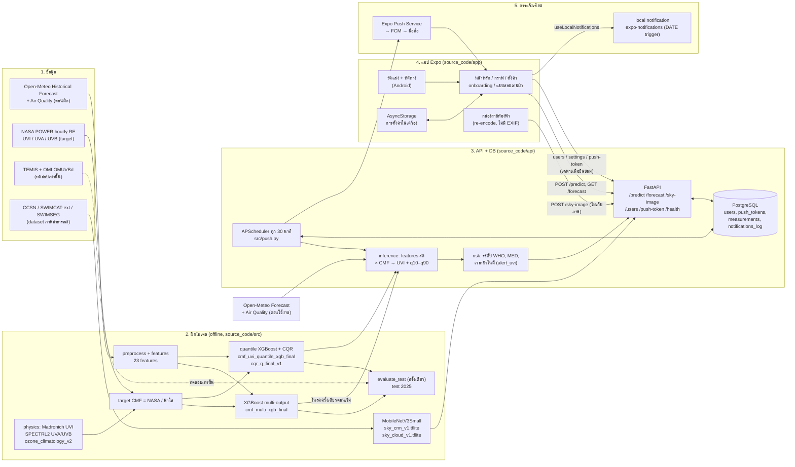
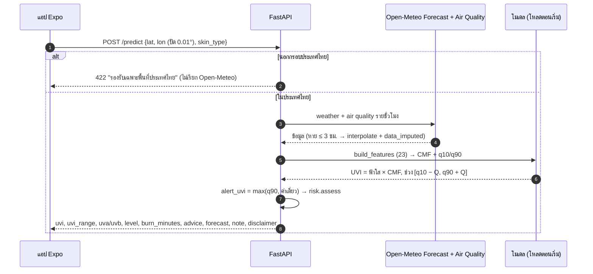
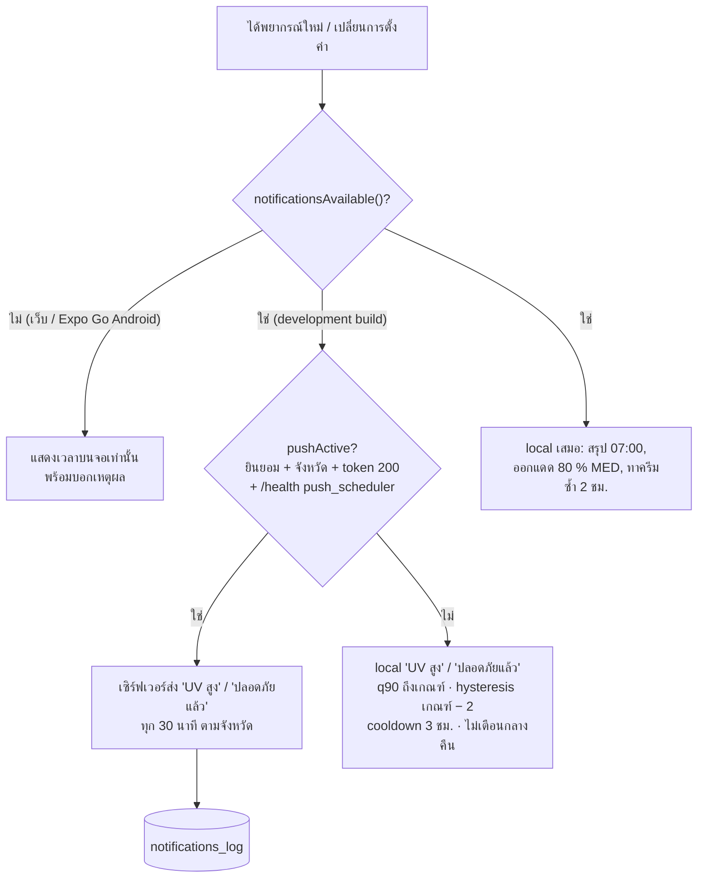

# UV Guard: สถาปัตยกรรมระบบ (วัน 28)

ไดอะแกรมเขียนด้วย Mermaid (GitHub แสดงผลเอง) ชื่อไฟล์และโมดูลตรงกับโค้ดใน repo ส่วนรายละเอียดของแต่ละขั้นอยู่ใน `ROADMAP.md`, `docs/api.md`, `docs/db.md` และ `source_code/app/README.md`

## 1. ภาพรวม: ข้อมูล → โมเดล → API/DB → แอป → การแจ้งเตือน

**หลักที่ไดอะแกรมนี้ยึดไว้** `[.agents/rules/00-project-context.md]`
- **NASA POWER ใช้เป็น target ตอนฝึกเท่านั้น** ไม่ใช่ feature และไม่ถูกเรียกตอนใช้งาน ตอนใช้งานใช้ Open-Meteo Forecast ตัวแปรชุดเดียวกับตอนฝึก
- **TEMIS/OMI ใช้ทดสอบเท่านั้น** (เส้นประ) ปี 2023 ใช้เลือกแหล่ง target และปี 2025 เป็น test
- **CNN เป็นโมดูลแยก:** ไม่ได้ต่อเข้า `INF` และไม่เปลี่ยนค่า UVI
- **ค่า lux ไม่ถูกส่งไปเซิร์ฟเวอร์** และไม่เปลี่ยนค่า UVI

## 2. คำขอ `/predict` (ตอนใช้งาน)

`[docs/api.md]`, `[ROADMAP.md วัน 16, 21]`

## 3. การแจ้งเตือน: local หรือ push

`[ROADMAP.md วัน 22–23]`, `[source_code/app/README.md]`

**ข้อจำกัดของการแจ้งเตือน:**
- ไม่ขอสิทธิ์ `SCHEDULE_EXACT_ALARM` แจ้งเตือนที่ตั้งเวลาไว้จึงอาจมาช้า
- push จากเซิร์ฟเวอร์ทดสอบด้วยตัวส่งปลอมเท่านั้น การรับบนมือถือจริงต้องใช้ build ที่มี FCM
- แอปตรวจ `pushActive` เฉพาะตอนเปิดแอป
