# UV Guard: ระบบประเมินรังสี UV และเตือนความเสี่ยงผิวไหม้รายบุคคลด้วยสมาร์ตโฟน

โครงงานรายวิชา Machine Learning, วิศวกรรมคอมพิวเตอร์ มทร.ธัญบุรี · ร่างรายงาน (4 ต.ค. 2026)

> **วิธีอ่านตัวเลข:** ทุกตัวเลขคัดมาจากไฟล์ในโปรเจกต์ และมีที่มากำกับในวงเล็บเหลี่ยม เช่น `[docs/test_2025_criteria.csv]` ไม่มีการคำนวณใหม่ในรายงานนี้ "dev" = ปี 2024 (โมเดลฝึกบนปี 2023) "test" = ปี 2025 (โมเดลฝึกใหม่บน 2023–2024 แล้วประเมินครั้งเดียว) ผลทดสอบภาคสนามวันที่ 4 ต.ค. 2026 (§4.8) มาจาก**บันทึกของผู้ทดสอบ** ไม่ใช่ไฟล์ผลลัพธ์ในโปรเจกต์ ข้อที่ไม่ได้บันทึกเขียนว่า "ไม่ได้จด" และข้อที่ไม่ได้ทำเขียนว่า "ไม่ได้ทดสอบ"
>
> **ไม่ได้ใช้เครื่องวัด UV ภาคพื้นดินเลย** ค่าอ้างอิงทั้งหมดเป็นผลิตภัณฑ์จากดาวเทียม/แบบจำลอง (NASA POWER, OMI, TEMIS) ผลทั้งหมดเป็นค่าประมาณเพื่อการศึกษาและการเตือน **ไม่ใช่การวินิจฉัยทางการแพทย์**

---

## 1. บทนำ

### 1.1 ที่มาและปัญหา
รังสีอัลตราไวโอเลต (UV) จากดวงอาทิตย์ทำให้ผิวไหม้ได้ และความเสี่ยงของแต่ละคนขึ้นกับทั้งปริมาณ UV และประเภทผิว ค่า UV Index (UVI) ที่มีให้ใช้ฟรีทางเว็บมักเป็นค่าพยากรณ์ที่ไม่ได้บอกช่วงความไม่แน่นอน และไม่ได้แปลงเป็นเวลาที่ผิวของผู้ใช้จะไหม้ ตัวอย่างในโปรเจกต์นี้: `uv_index` ของ Open-Meteo มี MAE 2.428 เทียบ OMI ตอนเที่ยงปี 2023 และค่าสูงสุดอิ่มตัวที่ราว UVI 9.3 `[docs/source_selection_2023.csv]`, `[ROADMAP.md วัน 2]`

### 1.2 วัตถุประสงค์
1. ประมาณ UVI, UVA และ UVB ณ ตำแหน่งของผู้ใช้ พร้อมช่วงความไม่แน่นอน (q10–q90)
2. แปลงค่า UV เป็นความเสี่ยงส่วนบุคคลตามประเภทผิว Fitzpatrick I–VI: ระดับ WHO, เวลาก่อนผิวไหม้ และคำแนะนำ SPF/PA
3. เตือนผู้ใช้ผ่านแอปมือถือด้วยการแจ้งเตือน โดยใช้ค่าบนของช่วง (q90) เพื่อไม่ให้เตือนช้าเกินไป
4. พยากรณ์ UV ล่วงหน้า 6–24 ชม.
5. ใช้ภาพท้องฟ้าจากกล้องมือถือเป็นข้อมูลประกอบ (สภาพท้องฟ้าและสัดส่วนเมฆ)

### 1.3 ขอบเขต
- **ใช้แค่สมาร์ตโฟน** ไม่มีเซนเซอร์หรือฮาร์ดแวร์เสริม input มีแค่ GPS, นาฬิกา, กล้อง, เซนเซอร์แสง (Android), accelerometer และ API ฟรี (Open-Meteo)
- **พื้นที่ฝึกและทดสอบ:** ปทุมธานี (14.02N, 100.52E, Asia/Bangkok) ที่เดียว `[.agents/rules/00-project-context.md]`
- **ระยะเวลา:** 30 วัน (23 ก.ย. – 22 ต.ค. 2026) `[ROADMAP.md]`
- **ไม่ใช่เครื่องมือแพทย์** ทุกหน้าจอของแอปและทุก response ของ API มี disclaimer `[docs/api.md]`

### 1.4 ภาพรวมระบบ
```
GPS / เวลา / Open-Meteo (weather + air quality)
  → feature engineering (23 features)
  → clear-sky physics: UVI (Madronich), UVA/UVB (pvlib SPECTRL2)
  × CMF จาก XGBoost multi-output   → ช่วง q10–q90 (quantile XGBoost + CQR)
  → Risk Engine (ระดับ WHO, เวลาผิวไหม้จากค่าบน, คำแนะนำ)
  → FastAPI + PostgreSQL → แอป Expo + การแจ้งเตือน (local + push จากเซิร์ฟเวอร์)

ภาพท้องฟ้า → CNN (โมดูลแยก): สภาพท้องฟ้า SWIMCAT-ext + สัดส่วนเมฆในภาพ (SWIMSEG head)
           → แสดงเป็นข้อมูลประกอบเท่านั้น ไม่เปลี่ยนค่า UVI
```
`[README.md]`, `[.agents/rules/00-project-context.md]` (ไดอะแกรมสถาปัตยกรรมฉบับเต็มเป็นงานวัน 28)

---

## 2. ทฤษฎี

### 2.1 UV Index, UVA และ UVB
- UVB = 280–315 nm, UVA = 315–400 nm
- UVI เป็นค่า erythemal irradiance (ถ่วงตามผลต่อผิวหนัง) โดย **1 UVI = 0.025 W/m²**
- ระดับ WHO: 0–2 ต่ำ, 3–5 ปานกลาง, 6–7 สูง, 8–10 สูงมาก, 11+ รุนแรงมาก ระบบปัดค่าเป็นจำนวนเต็ม (x.5 ปัดขึ้น) ก่อนแปลงเป็นระดับ ใช้กติกาเดียวกันทั้งตอนประเมินและในแอป `[.agents/rules/00-project-context.md]`, `[ROADMAP.md วัน 19]`

### 2.2 UVI ฟ้าใส (Madronich) และโอโซน
ใช้สูตรประมาณ **UVI = 12.5 · μ^2.42 · (O₃/300)^−1.23** โดย μ = cos(มุมเซนิท) และตัดค่าติดลบเป็น 0 ค่า O₃ (DU) มาจาก **climatology รายเดือน** ที่สร้างจาก NASA POWER TO3 ปี 2023–2024 (`ozone_climatology_v2.json`) และใช้ค่าเดียวกันทั้งตอนฝึกและตอนใช้งาน
- climatology ต่างจาก TO3 จริงเฉลี่ย 2.2 % ของ UVI (p95 4.2 %)
- ถ้าใช้ค่าคงที่ 300 DU จะได้ค่าต่ำเป็นระบบ −15.2 % (ถึง −23 % ในเดือนหนาว) `[ROADMAP.md วัน 3 (notebook 03_clear_sky.ipynb) · ไม่มีไฟล์ผลลัพธ์ให้ตรวจซ้ำ]`

`[ROADMAP.md วัน 3]`

### 2.3 UVA/UVB ฟ้าใสด้วย SPECTRL2
ใช้ `pvlib.spectrum.spectrl2` (climatology ozone, AOD = 0, ไอน้ำ 4 cm, albedo 0.2) แล้วอินทิเกรต 300–315 nm (UVB) และ 315–400 nm (UVA) กริดของ SPECTRL2 เริ่มที่ 300 nm และช่วง UVB มีแค่ 4 จุด (300/305/310/315 nm) ในขณะที่ NASA POWER นิยาม UVB เป็น 280–315 nm `[ROADMAP.md วัน 4]`

### 2.4 Cloud Modification Factor (CMF)
CMF = ค่าจริง (NASA POWER) / ค่าฟ้าใส ใช้ทั้ง 3 ตัว คือ CMF_UVI, CMF_A, CMF_B โมเดลทำนาย CMF แล้วระบบคำนวณ **UV = ค่าฟ้าใส × CMF**
- **ตัวหาร:** เป็นค่าเฉลี่ยทั้งชั่วโมง (12 จุด) ไม่ใช่ค่าที่จุดกึ่งกลาง เพราะ NASA POWER เป็นค่าเฉลี่ยรายชั่วโมง ถ้าใช้จุดกึ่งกลางจะต่าง 6–10 % (สูงสุด 13 %) ในชั่วโมงแรกและสุดท้ายของวัน `[ROADMAP.md วัน 3]`
- **ไม่ใส่ฝุ่นละอองในตัวหารโดยตั้งใจ (AOD = 0):** CMF จึงรวมผลของ "เมฆ + ฝุ่นละออง" ในชั่วโมงฟ้าเปิด NASA POWER ได้ 0.72 เท่าของ Madronich และอัตราส่วนลดลงตาม AOD (0.80 → 0.66, r −0.47) `[ROADMAP.md วัน 3 (notebook 03_clear_sky.ipynb) · ไม่มีไฟล์ผลลัพธ์ให้ตรวจซ้ำ]` จึงต้องใส่ AOD/PM2.5 เป็น feature `[ROADMAP.md วัน 3–4]`
- ตัดชั่วโมงที่ UVI ฟ้าใส < 0.5 ออก (ช่วงเช้าตรู่และเย็น)

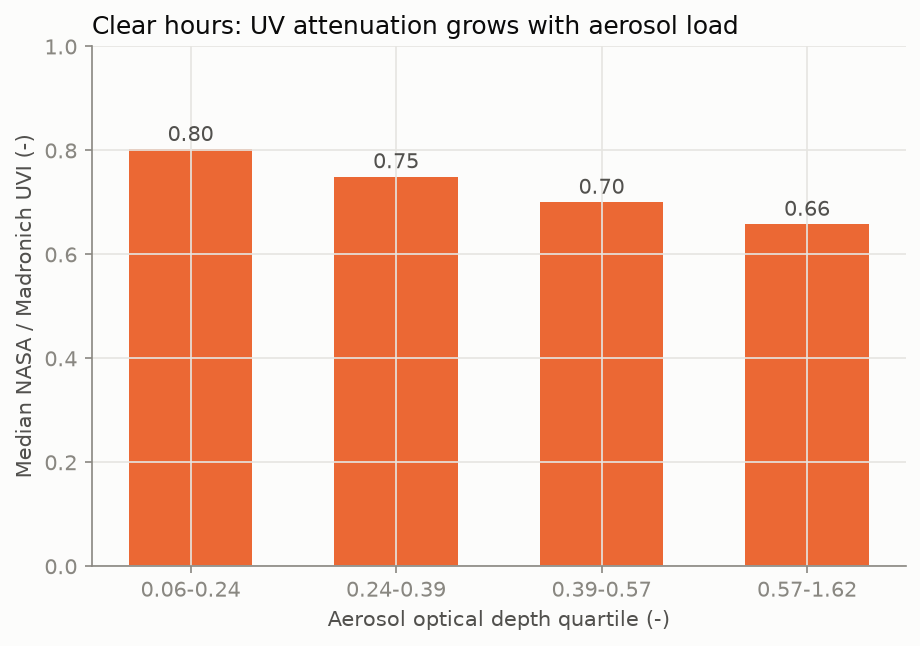
*รูปที่ 1 อัตราส่วน NASA POWER / ฟ้าใส ในชั่วโมงฟ้าเปิด เทียบกับ AOD ใช้เป็นเหตุผลว่าทำไม CMF ต้องรวมผลของฝุ่นละออง `[docs/figures/phys_aod_ratio.png]`*

### 2.5 XGBoost, quantile regression และ CQR
- **XGBoost:** gradient-boosted trees ใช้ `MultiOutputRegressor` ทำนาย CMF_UVI, CMF_A และ CMF_B พร้อมกัน
- **Quantile regression:** XGBoost `reg:quantileerror` ให้ q10/q50/q90 ของ CMF_UVI
- **Conformalized Quantile Regression (CQR):** ขยายช่วงเป็น [q10 − Q, q90 + Q] โดยคำนวณ Q จากข้อมูล calibration เพื่อให้ coverage ใกล้ 80 % `[ROADMAP.md วัน 9]`

### 2.6 LSTM encoder–decoder
รับ sliding window 48 ชม. ย้อนหลัง + covariate 24 ชม. ข้างหน้าจากพยากรณ์ Open-Meteo แล้วทำนาย CMF_UVI ของ t+1…t+24 `[ROADMAP.md วัน 11–12]`

### 2.7 Transfer learning และอัตราส่วนแดง/น้ำเงิน
- **CNN:** backbone MobileNetV3Small (ImageNet) ร่วมกัน + head แยกตาม dataset `[source_code/models/sky_cnn_v1_metrics.json]`
- **Baseline สัดส่วนเมฆ:** พิกเซลที่ NRBR = (B − R)/(B + R) < 0.25 ถือว่าเป็นเมฆ ใช้ค่าจากงานวิจัยโดยไม่ได้ปรับ `[ROADMAP.md วัน 14]`

### 2.8 ความเสี่ยงผิวไหม้
- **MED (J/m²):** I 200, II 250, III 350, IV 450, V 600, VI 1000
- **เวลาก่อนผิวไหม้ (นาที)** = MED / (UVI × 0.025 × 60) ใช้ **ค่าบน (q90)** เสมอ
- **ปุ่ม "ออกแดด":** สะสมปริมาณ UV รายชั่วโมงแล้วเตือนที่ 80 % ของ MED `[.agents/rules/00-project-context.md]`, `[ROADMAP.md วัน 22]`
- **แบบสอบถามผิว 5 ข้อ:** ดัดแปลงจาก Fitzpatrick และ**ยังไม่ผ่านการตรวจสอบทางวิชาการ** `[docs/skin_quiz.md]`

---

## 3. วิธีการ

### 3.1 แหล่งข้อมูล

**ตาราง A** แหล่งข้อมูลและการใช้งาน `[.agents/rules/00-project-context.md]`, `[docs/datasets.md]`

| แหล่ง | ใช้ทำอะไร | ตัวแปร | หมายเหตุ / license |
|---|---|---|---|
| Open-Meteo Historical Forecast API + Forecast API | features (ตอนฝึก / ตอนใช้งาน) | weather, radiation, cloud cover, `uv_index` | ไม่ต้องใช้ API key ค่าตรงกันทุกค่า (16/16 ตัวแปร, 72/72 ชม.) `[ROADMAP.md วัน 16]` |
| Open-Meteo Air Quality (CAMS) | features | AOD, dust, PM2.5, ozone ผิวพื้น | ozone ผิวพื้น (µg/m³) ไม่ใช่ total column |
| NASA POWER hourly, community RE | **target (ground truth)** | ALLSKY_SFC_UV_INDEX, UVA, UVB | ไม่ใช้ community AG เพราะปัดเป็น 0.01 MJ/hr ทำให้ UVB แทบเป็น 0 `[ROADMAP.md วัน 1]` |
| TEMIS (Bangkok 13.667N 100.612E) | ทดสอบเท่านั้น | UVI ฟ้าใสตอนเที่ยง | มีเฉพาะฟ้าใส |
| NASA OMI OMUVBd v003 | ทดสอบเท่านั้น | UVI ฟ้ามีเมฆ + irradiance 305/310/324/380 nm | 1°, วันละครั้ง |
| CCSN | CNN | 2,543 ภาพ 11 ชนิดเมฆ | CC0 1.0 |
| SWIMCAT-ext | CNN | 2,100 ภาพ 6 สภาพท้องฟ้า | CC BY 4.0 (ใช้เพื่อการศึกษา) |
| SWIMSEG | CNN head สัดส่วนเมฆ | 1,013 ภาพ + mask | CC BY-NC 4.0 |
| Open-Meteo Geocoding (GeoNames) | พิกัด 77 จังหวัดในแอป | — | CC BY 4.0 ไม่ใช้ฝึก |

**ข้อมูล TEMIS/OMI ที่ใช้:** ปี 2023 ใช้เลือกแหล่ง target เท่านั้น ปี 2025 เป็น test ส่วนปี 2024 ไม่ได้ใช้ เพราะซ้อนกับปี dev `[ROADMAP.md วัน 2]`

### 3.2 การเลือก ground truth ด้วยกฎที่ประกาศก่อนดูผล
กฎ: เลือก NASA POWER ก็ต่อเมื่อ MAE เทียบ OMI UVI (ฟ้ามีเมฆ, เที่ยง, ปี 2023) ต่ำกว่า Open-Meteo **เกิน 0.3**

**ตาราง B** `[docs/source_selection_2023.csv]` (คัดจาก `[docs/results_summary.md]` §1)

| แหล่ง | เทียบกับ | ชุดข้อมูล | n | MAE | bias |
|---|---|---|---|---|---|
| Open-Meteo `uv_index` | OMI UVindex (ฟ้ามีเมฆ) | ทุกวัน | 275 | 2.428 | −2.339 |
| NASA POWER `nasa_uvi` | OMI UVindex (ฟ้ามีเมฆ) | ทุกวัน | 275 | **1.143** | −0.989 |
| Open-Meteo `uv_index_clear_sky` | TEMIS ฟ้าใส | ทุกวัน | 365 | 3.500 | −3.500 |
| NASA POWER `nasa_uvi` | TEMIS ฟ้าใส | NASA cloud < 10 % | 71 | 2.679 | −2.679 |

→ เลือก **NASA POWER** (ต่างกัน 1.285 > 0.3)

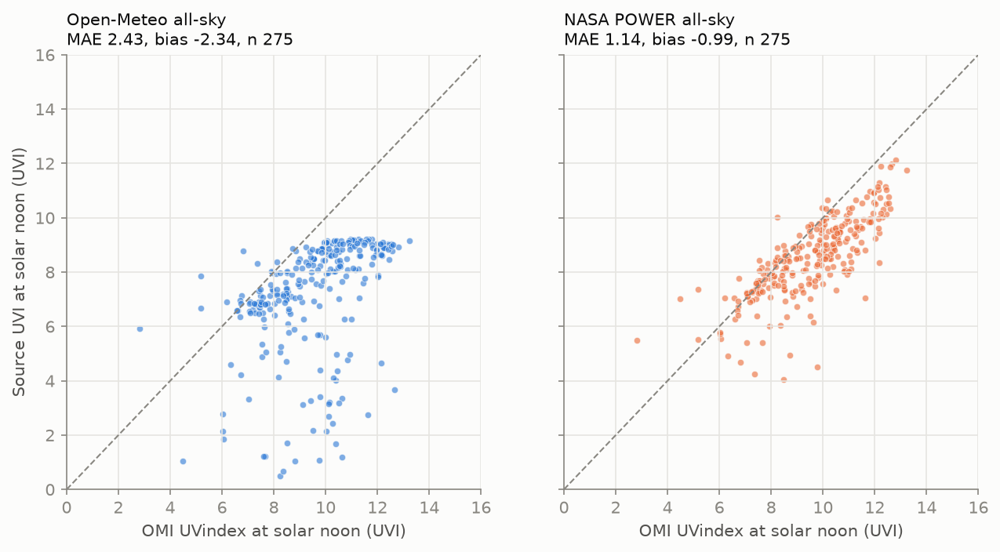
*รูปที่ 2 UVI ตอนเที่ยงของ Open-Meteo และ NASA POWER เทียบ OMI ปี 2023 (ชุดที่ใช้เลือกแหล่ง) `[docs/figures/sel_omi_2023.png]`*

### 3.3 การเตรียมข้อมูล, features และ target
- **เตรียมข้อมูล:** รวมตามเวลา UTC ข้อมูล NASA POWER ใช้ label ต้นชั่วโมงจึงเลื่อน +1 ชม. ค่า ozone > 400 µg/m³ ตั้งเป็น NaN แล้ว interpolate `[ROADMAP.md วัน 1–2]`
- **ตารางข้อมูลฝึก:** 11,156 แถว (2023: 3,712 / 2024: 3,726 / 2025: 3,718) เป็นชั่วโมงกลางวันที่ `uvi_clear ≥ 0.5` `[ROADMAP.md Checkpoint วัน 5]`, `[source_code/models/dataset_spec_v1.json]`
- **Features 23 ตัว** มาจาก Open-Meteo หรือคำนวณจากเวลา/ตำแหน่งเท่านั้น `[source_code/models/dataset_spec_v1.json]`:
  - `cos_sza`, `hour_sin`, `hour_cos`, `month_sin`, `month_cos`
  - `uv_index`, `uv_index_clear_sky`
  - `cloud_cover`, `cloud_cover_low/mid/high`
  - `relative_humidity_2m`, `temperature_2m`
  - `shortwave/direct/diffuse_radiation`, `precipitation`
  - `om_kt` (shortwave / GHI ฟ้าใส), `om_diffuse_fraction`
  - `aerosol_optical_depth`, `dust`, `pm2_5`, `ozone`
- **ห้ามใช้คอลัมน์ NASA POWER เป็น feature** (CLOUD_AMT, SW_DWN, TO3) เพราะไม่มีตอนใช้งานจริง และเป็น target leakage `[ROADMAP.md วัน 5]`
- **การกระจายของ target:** CMF_UVI median 0.635 (p01 0.265, p99 0.874), CMF_A median 0.751, CMF_B median 0.761 `[docs/results_summary.md §1]`
- **การ clip:** clip เฉพาะค่าทำนาย CMF ให้อยู่ใน [0, 1] ไม่ clip target `[ROADMAP.md วัน 5–6]`

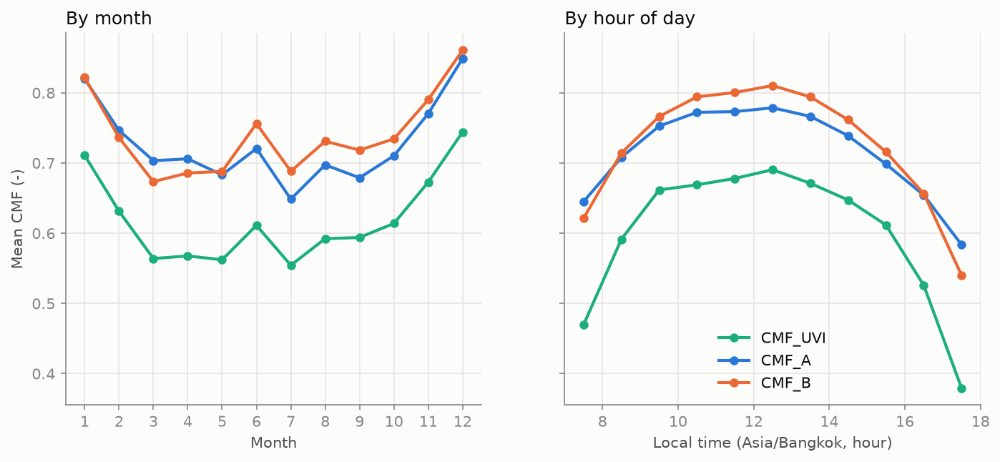
*รูปที่ 3 CMF_UVI ตามเดือนและชั่วโมง `[docs/figures/ds_cmf_month_hour.png]`*

### 3.4 การแบ่งข้อมูลตามเวลาและการกันข้อมูลรั่ว
- **Train = 2023, Dev = 2024, Test = 2025** (`src/splits.py`) ข้อมูลปี 2025 ถูกกรองออกตั้งแต่ตอนอ่าน (`load_model_data()`) และ `chronological_split()` ตรวจว่าไม่มีแถวปี 2025 หลุดเข้ามา `[ROADMAP.md วัน 6]`
- **Cross-validation:** TimeSeriesSplit 5 folds ภายใน 2023–2024 เว้น gap 12 แถว (≈ 1 วัน) `[ROADMAP.md วัน 7]`
- **ประกาศเกณฑ์ก่อนเปิด test (pre-registration):** เกณฑ์ของ test 2025, LSTM, CNN และ SWIMSEG ถูก commit ก่อนอ่าน test และโค้ดมี guard ให้รัน `--test` ได้ครั้งเดียว หลังเห็นผลห้ามแก้โมเดล `[ROADMAP.md วัน 10, 12, 14, ส่วนเสริม]`
- **ข้อจำกัดของการกันข้อมูลรั่ว:** ก่อนวัน 6 ozone climatology v1 และ notebook EDA เคยใช้ข้อมูลทั้ง 3 ปี จึงสร้าง climatology ใหม่เป็น v2 จาก 2023–2024 ส่วน EDA ไม่ได้ใช้เลือกโมเดล `[ROADMAP.md วัน 6]`

**ตาราง C** ตรวจข้อมูลรั่ว `[docs/leakage_checks.csv]`

| ตรวจ | ผล | รายละเอียด |
|---|---|---|
| ไม่มีแถวปี 2025 | ✅ | 0 แถว ≥ 2025 |
| features ไม่มีคอลัมน์ NASA / target / ตัวหาร | ✅ | ไม่มี |
| fold เรียงตามเวลา มี gap ไม่มี timestamp ซ้ำ | ✅ | gap 12 แถวทุก fold |
| ไม่มี feature ที่ \|Spearman\| > 0.95 กับ cmf_uvi | ✅ | สูงสุด 0.656 (direct_radiation) |
| โมเดลที่ฝึกกับ target สุ่มสลับได้ R² ≤ 0.05 | ✅ | R² −0.105 |

### 3.5 โมเดล CMF
1. **Baseline:** CMF คงที่ (ค่าเฉลี่ยของ train), `uv_index` ของ Open-Meteo, linear regression
2. **XGBoost** ทำนาย CMF_UVI ถ่วงน้ำหนัก `uvi_clear²` (เลือกด้วยกฎที่ประกาศไว้ แต่ความต่างอยู่ในระดับ noise) `[docs/weight_experiment_dev_2024.csv]`
3. **Multi-output XGBoost** ทำนาย [CMF_UVI, CMF_A, CMF_B]
4. **Optuna** 100 trials (TPE seed 42 + MedianPruner) objective คือ UVI MAE ของ fold 3–5 กฎรับ params: MAE ดีขึ้น > 0.01 และ recall ระดับเตือนลดลง ≤ 0.03 `[ROADMAP.md วัน 8]`
5. **Quantile XGBoost + CQR:** ใช้ q90 หลัง CQR สำหรับการเตือน ในระบบจริงใช้ `alert_uvi = max(q90 หลัง CQR, ค่าเดี่ยว)` `[ROADMAP.md วัน 9, 16]`
6. **โมเดลสุดท้าย:** refit บน 2023–2024 ได้ Q = +0.0379 (สเกล CMF) `[source_code/models/cqr_q_final_v1.json]`

### 3.6 พยากรณ์ 6–24 ชม. (LSTM เทียบ XGBoost)
- **ข้อมูล:** window 48 → 24 ชม. ได้ train 8,540 window (ปี 2023) และ dev 8,761 window (ปี 2024) z-score ด้วยสถิติของปี 2023 ไม่มี NASA POWER เป็น input `[ROADMAP.md วัน 11]`
- **โมเดล:** encoder–decoder units 64, dropout 0.2, 3 seeds เลือก LSTM แทน GRU ด้วย validation loss ช่วง พ.ย.–ธ.ค. 2023 (0.00426 เทียบ 0.00478) `[ROADMAP.md วัน 12]`
- **เกณฑ์ที่ประกาศไว้:** LSTM ชนะต่อเมื่อ MAE บน dev ต่ำกว่า B1 (XGBoost + features Open-Meteo, 0.450) **เกิน 0.02** และ recall ≥ สูงมากลดลงไม่เกิน 0.03

### 3.7 โมดูลภาพท้องฟ้า (แยกจากโมเดล UV)
- **ทำไมไม่รวมกับ XGBoost:** ไม่มีภาพท้องฟ้าของปทุมธานีที่จับคู่กับ target ของ NASA POWER ได้ จึงทำเป็น**โมดูลแยก** ผลแสดงเป็นข้อมูลประกอบ ไม่เปลี่ยน UVI `[ROADMAP.md วัน 13]`
- **การจัดการ dataset:** แต่ละ dataset ใช้ label และ test split ของตัวเอง ภาพซ้ำ (thumbnail 16×16, 8 แบบหมุน/พลิก, MAD < 0.03) อยู่ใน split เดียวกัน CCSN มี 263 ภาพ (124 กลุ่ม) ที่เป็นรูปเดียวกันแต่ label ต่างชนิดเมฆ จึงถูกตัดออก `[docs/datasets.md]`
- **Augmentation:** crop กลาง + 224 px แล้ว flip, หมุน ±15°, perspective, ความสว่าง, contrast, white balance, saturation, blur เพื่อลด domain gap
- **ฝึก 2 ขั้น:** freeze backbone แล้ว unfreeze 30 % บน, early stopping บน val, 3 seeds (42/43/44) export TFLite float16 `[ROADMAP.md วัน 14]`
- **Head สัดส่วนเมฆจาก SWIMSEG:** backbone ของวัน 14 แช่ทั้งหมด + Dense(1, sigmoid) แบ่ง split **ตามวันถ่าย** (1,013 ภาพมาจาก 33 ครั้งใน 17 วัน): train 735 / 9 วัน, val 137 / 3 วัน, test 141 / 5 วัน `[ROADMAP.md ส่วนเสริม]`

### 3.8 ระบบซอฟต์แวร์
- **FastAPI:** โหลดโมเดลครั้งเดียวตอนเริ่ม ใช้ input จาก Open-Meteo Forecast + Air Quality เท่านั้น (ไม่เรียก NASA POWER) ตรวจแล้วว่า `build_features()` ให้ features ตรงกับ `train.parquet` ทั้ง 23 ตัว (7,394 แถว ต่างกันสูงสุด 0) `[ROADMAP.md วัน 16]`
- **ข้อมูลหาย:** interpolate ได้ไม่เกิน 3 ชม. และติดธง `data_imputed` ถ้าชั่วโมงปัจจุบันไม่มีข้อมูลจะตอบ 503 `[ROADMAP.md วัน 16]`
- **PostgreSQL 18 + Alembic:** ตาราง users, push_tokens, measurements, notifications_log ไม่เก็บชื่อ อีเมล หรือภาพ พิกัดปัดเหลือ 0.01° ลบ user แล้วข้อมูลที่ผูกไว้ถูกลบด้วย CASCADE `[ROADMAP.md วัน 17]`, `[docs/db.md]`
- **ความยินยอม (PDPA):** ประเภทผิวเป็นข้อมูลสุขภาพ จึงส่งไปเซิร์ฟเวอร์ต่อเมื่อผู้ใช้เปิดสวิตช์ยินยอมเอง (ปิดเป็นค่าเริ่มต้น) ส่งแค่ชื่อจังหวัด ไม่ส่งพิกัด GPS `[ROADMAP.md วัน 19, 21]`
- **แอป Expo (SDK 57, TypeScript):**
  - onboarding, แบบสอบถามผิว, หน้าหลัก (UVI + ช่วง, UVA/UVB, เวลาผิวไหม้, กราฟรายชั่วโมง)
  - กล้องถ่ายท้องฟ้า: re-encode ภาพใหม่ทุกครั้งเพื่อตัด EXIF และลบไฟล์ใน `finally`
  - วัดแสง (Android) และหน้าตั้งค่า
  - เลือกได้ 77 จังหวัดเมื่อไม่อนุญาตตำแหน่ง `[ROADMAP.md วัน 18–21]`
- **การแจ้งเตือน:**
  - **Local notification (ตั้งเวลาล่วงหน้าจากพยากรณ์):** เตือนเมื่อ q90 ถึงเกณฑ์, "ปลอดภัยแล้ว" ที่เกณฑ์ − 2 (hysteresis), cooldown 3 ชม. ต่อประเภท, ไม่เตือนตอนกลางคืน, สรุป 07:00, เตือนที่ 80 % ของ MED, เตือนทาครีมซ้ำทุก 2 ชม.
  - **Push จากเซิร์ฟเวอร์:** APScheduler ทุก 30 นาที + Expo Push Service ต้องยินยอมก่อน ถ้า push ใช้ได้ แอปจะไม่ตั้ง local "UV สูง/ปลอดภัยแล้ว" ซ้ำ `[ROADMAP.md วัน 22–23]`

**ตาราง D** endpoint ของ API `[docs/api.md]`, `[ROADMAP.md วัน 23]`

| Method | Path | หน้าที่ |
|---|---|---|
| GET | `/health` | สถานะ, โมเดลที่โหลด, `db_backend`, `push_scheduler` |
| POST | `/predict` | UVI + ช่วง, UVA/UVB, ระดับ, เวลาผิวไหม้, CMF, คำแนะนำ, พยากรณ์, `next_safe_time` |
| GET | `/forecast` | พยากรณ์รายชั่วโมง 1–36 ชม. (`alert_uvi`, `is_daylight`) |
| POST | `/sky-image` | สภาพท้องฟ้า SWIMCAT-ext, สัดส่วนเมฆ red/blue และ CNN (`stored: false`) |
| POST | `/users` · PUT `/users/{id}/settings` · DELETE `/users/{id}` | ผู้ใช้ (device id แบบสุ่ม) และการตั้งค่า |
| PUT | `/users/{id}/push-token` | ลงทะเบียน Expo push token |

### 3.9 วิธีทดสอบ
- **pytest** (Python: src, API, DB บน PostgreSQL จริง) และ **Jest** (แอป) ทุกฟังก์ชันใน `source_code/src/` มี docstring และเทส
- **ทดสอบบนมือถือจริง:** Samsung (Android) ด้วย Expo Go ตั้งแต่ 28 ก.ย. 2026 ส่วน development build (EAS) ทดสอบวันที่ 4 ต.ค. ตามเช็กลิสต์ `docs/field_test_2026-10-04.md`
- **ภาคสนาม (วัน 25):** จดค่า lux 4 สภาพ และ UVI ของแอปเทียบ Open-Meteo ณ เวลาและที่เดียวกัน **จดด้วยมือ** เพราะแอปยังไม่มี export CSV

---

## 4. ผลลัพธ์

### 4.1 แหล่ง target
NASA POWER มี MAE เทียบ OMI ต่ำกว่า Open-Meteo 1.285 UVI (ตาราง B) และ Open-Meteo อิ่มตัวที่ราว UVI 9.3 `[ROADMAP.md วัน 2]`

### 4.2 โมเดล CMF บน dev 2024

**ตาราง E** baseline และ XGBoost (dev 2024, สเกล UVI) `[docs/baseline_dev_2024.csv]`

| โมเดล | UVI MAE | R² | recall สูงมาก | recall รุนแรงมาก |
|---|---|---|---|---|
| CMF คงที่ (ค่าเฉลี่ยของ train) | 0.703 | 0.889 | 0.631 | 0.000 |
| Open-Meteo `uv_index` (ไม่มีโมเดล) | 1.252 | 0.676 | 0.591 | 0.000 |
| Linear regression | 0.473 | 0.941 | 0.767 | 0.094 |
| XGBoost | **0.462** | 0.943 | 0.791 | 0.113 |

- **Multi-output v1:** UVI MAE 0.461, UVA 2.934 W/m², UVB 0.086 W/m² `[source_code/models/cmf_multi_xgb_v1_metrics.json]`
- **TimeSeriesSplit 5 folds:** UVI 0.493 ± 0.078, UVA 3.048 ± 0.329, UVB 0.090 ± 0.011 `[docs/cv_folds_2023_2024.csv]`
- **fold ที่แย่ที่สุด:** fold 2 (ก.ย.–ธ.ค. 2023) bias −0.44 เพราะฝึกด้วยข้อมูลไม่ครบฤดู `[ROADMAP.md วัน 7]`

**ตาราง F** Optuna `[docs/tuning_dev_2024.csv]`, `[source_code/models/cmf_xgb_best_params_v1.json]`

| กฎที่ประกาศไว้ | ค่า | ผ่าน |
|---|---|---|
| CV MAE (fold 3–5) ดีขึ้น > 0.01 | 0.4579 → 0.4466 (+0.0113) | ✅ (เฉียดฉิว) |
| recall เตือนเฉลี่ยลดลง ≤ 0.03 | 0.438 → 0.443 (ไม่ลด) | ✅ |

- **ผลการ tune:** 100 trials (complete 42, pruned 58) ได้ multi-output บน dev 2024 UVI 0.461 → 0.450, UVA 2.934 → 2.871, UVB 0.086 → 0.084 แต่ตัวเลขนี้**มองโลกในแง่ดีเกินจริง** เพราะ fold 3–5 อยู่ในปี 2024 `[docs/results_summary.md §2]`
- **การ tune ไม่ได้แก้การเตือนระดับรุนแรงมาก:** recall รุนแรงมากเฉลี่ยของ CV ลดจาก 0.20 เป็น 0.16 `[ROADMAP.md วัน 8]`

**ตาราง G** quantile + CQR `[source_code/models/cmf_uvi_quantile_xgb_v1_metrics.json]`, `[docs/quantile_alerts_cv_folds3-5.csv]`

| กฎที่ประกาศไว้ | ค่า | ผ่าน |
|---|---|---|
| coverage ช่วงดิบ [q10, q90] (CV fold 3–5) อยู่ใน [0.75, 0.85] | 0.593 | ❌ → ใช้ CQR |
| ตรวจ CQR: coverage ของ fold 5 (Q จาก fold 3–4) | 0.652 → 0.863 | — |
| coverage บน dev 2024 หลัง CQR (Q จาก 2023) | 0.578 → 0.837 | ✅ |
| quantile ต่ำสุดที่ recall รุนแรงมาก ≥ 0.8 และ precision ≥ สูงมาก ≥ 0.5 | ไม่มี (q90: 0.623 / 0.596) | ❌ → ใช้ q90 ตามกฎของโปรเจกต์ |

การเตือนบน CV fold 3–5 (ชั่วโมง ≥ สูงมาก 704, รุนแรงมาก 53) `[docs/results_summary.md §2]`:

| Quantile | ≥ สูงมาก recall / precision / FAR | รุนแรงมาก recall / precision |
|---|---|---|
| q50 | 0.839 / 0.765 / 0.060 | 0.113 / 0.600 |
| q75 | 0.926 / 0.732 / 0.079 | 0.132 / 0.500 |
| q90 (CQR) | 0.989 / 0.596 / 0.157 | 0.623 / 0.333 |

ข้อแลกเปลี่ยนของ CQR: ช่วงกว้างขึ้นจาก 0.81 เป็น 1.50 UVI (dev 2024) และ coverage ไม่สม่ำเสมอ (ระดับรุนแรงมาก 0.70, n = 10) `[ROADMAP.md วัน 9]`

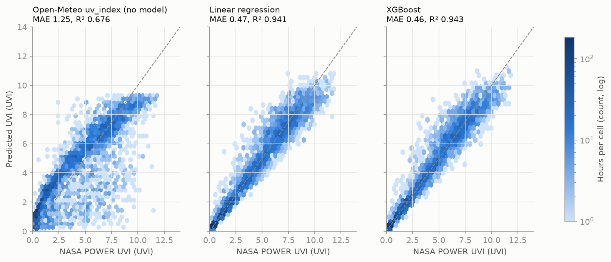
*รูปที่ 4 UVI ที่ทำนายเทียบ NASA POWER บน dev 2024 `[docs/figures/base_pred_vs_nasa_dev2024.png]`*

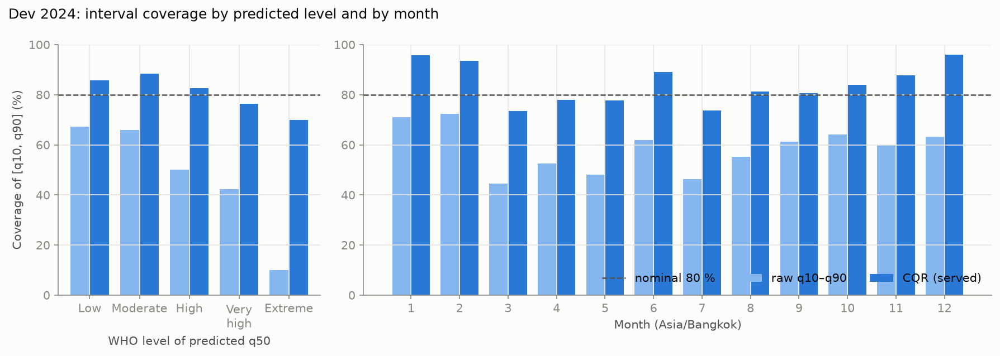
*รูปที่ 5 coverage ของช่วง q10–q90 ก่อนและหลัง CQR `[docs/figures/quantile_coverage.png]`*

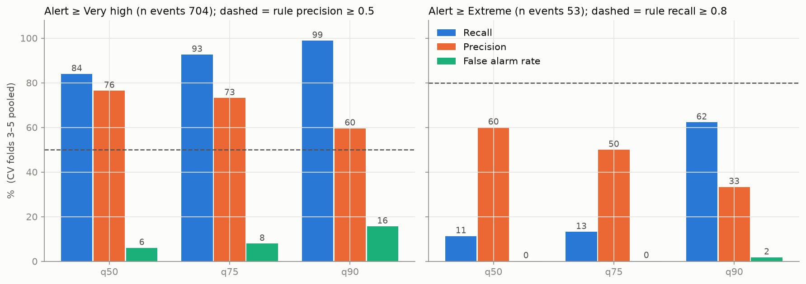
*รูปที่ 6 recall / precision ของการเตือนด้วย q50, q75 และ q90 `[docs/figures/quantile_alerts.png]`*

### 4.3 Test 2025 (ประเมินครั้งเดียว)
ประกาศเกณฑ์ไว้ใน commit `1641d10` / `1443ff9` ก่อนอ่านข้อมูลปี 2025 และหลังเห็นผลไม่ได้แก้อะไร ผล **ผ่าน 14 จาก 15 ข้อ ไม่ผ่าน T4** `[docs/test_2025_criteria.csv]`, `[docs/test_2025_results.json]`

**ตาราง H** เกณฑ์ test 2025 `[docs/test_2025_criteria.csv]`

| # | เกณฑ์ | ค่า | ผ่าน |
|---|---|---|---|
| T1 | MAE รายชั่วโมงเทียบ NASA POWER < 1.0 (checkpoint) | 0.479 | ✅ |
| T1b | ต่ำกว่า baseline ทุกตัว (CMF คงที่ 0.708, Open-Meteo 1.244, physics ฟ้าใส 2.471) | 0.479 | ✅ |
| T2a | MAE ตอนเที่ยงเทียบ OMI (ฟ้ามีเมฆ) ≤ 1.5 | 1.320 | ✅ |
| T2b | ≤ NASA POWER เทียบ OMI + 0.3 (1.330 + 0.3) | 1.320 | ✅ |
| T2c | ต่ำกว่า baseline ทุกตัวเมื่อเทียบ OMI (ต่ำสุด 1.960) | 1.320 | ✅ |
| T3a | physics ฟ้าใสเทียบ TEMIS (ทุกวัน) ≤ 1.0 | 0.764 | ✅ |
| T3b | โมเดลเทียบ TEMIS วันฟ้าเปิด ≤ 1.5 | 1.360 | ✅ |
| T3c | ≤ NASA POWER เทียบ TEMIS + 0.3 (1.580 + 0.3) | 1.360 | ✅ |
| **T4** | **Pearson r กับ OMI irradiance ≥ 0.7 ทั้ง 4 คู่** | **ต่ำสุด 0.533** | **❌** |
| T4b | r ≥ r ของ physics ฟ้าใสทุกคู่ | ต่างกันน้อยสุด +0.121 | ✅ |
| T5 | coverage ของช่วง CQR อยู่ใน [0.75, 0.85] | 0.806 | ✅ |
| T6a | q90 เตือน ≥ สูงมาก: recall ≥ 0.90 | 0.986 | ✅ |
| T6b | q90 เตือน ≥ สูงมาก: precision ≥ 0.50 | 0.564 | ✅ |
| T6c | q90 เตือน ≥ สูงมาก: false alarm rate ≤ 0.20 | 0.163 | ✅ |
| T6d | q90 เตือนรุนแรงมาก: recall ≥ 0.80 | 0.826 (19/23) | ✅ |

**T4 ไม่ผ่าน:** r ระหว่างโมเดลกับ OMI irradiance (โมเดล / physics ฟ้าใส) คือ 305 nm 0.646 / 0.525, 310 nm 0.630 / 0.436, 324 nm 0.533 / 0.313 และ 380 nm 0.572 / 0.203 ทุกคู่ต่ำกว่า 0.7 แต่ดีกว่า physics ฟ้าใสทุกคู่ (T4b) `[docs/results_summary.md §3]`

**ผลอื่น ๆ บน test 2025:**
- n = 3,718 ชม., UVA MAE 2.910 W/m², UVB 0.088 W/m² `[docs/test_2025_results.json]`
- R² 0.934 `[source_code/models/cmf_multi_xgb_final_metrics.json]`
- RMSE 0.752 (ตรวจซ้ำด้วยโมเดลที่โหลดจากดิสก์ใน `/checkpoint`) `[ROADMAP.md Checkpoint วัน 10]`
- **วันฟ้าเปิด:** โมเดลต่ำกว่า TEMIS 1.359 UVI (NASA POWER ต่ำกว่า 1.580) ในขณะที่ physics ฟ้าใสสูงกว่า 0.831 `[docs/results_summary.md §3]`

**ตาราง I** confusion matrix ระดับ WHO ของ q90 บน test 2025 (แถว = ระดับจริงจาก NASA POWER, คอลัมน์ = ระดับจาก q90) `[docs/test_2025_results.json → hourly_vs_nasa.who_q90]`, `[source_code/src/metrics.py]` (ทิศของแกน)

| จริง \ q90 | ต่ำ | ปานกลาง | สูง | สูงมาก | รุนแรงมาก | recall |
|---|---|---|---|---|---|---|
| ต่ำ | 1087 | 201 | 5 | 3 | 0 | 0.839 |
| ปานกลาง | 0 | 651 | 297 | 67 | 0 | 0.641 |
| สูง | 0 | 5 | 319 | 425 | 4 | 0.424 |
| **สูงมาก** | 0 | 0 | 9 | 535 | 87 | **0.848** |
| **รุนแรงมาก** | 0 | 0 | 0 | 4 | 19 | **0.826** |

**การเตือนด้วย q90** `[docs/test_2025_results.json → hourly_vs_nasa.alerts_q90]`
- **≥ สูงมาก:** มีเหตุการณ์จริง 654 ชม. เตือน 1,144 ครั้ง (TP 645, FP 499, FN 9)
- **รุนแรงมาก:** มีเหตุการณ์จริง 23 ชม. เตือน 110 ครั้ง (TP 19, FP 91, FN 4) precision 0.173
- **ความไม่แน่นอน:** recall รุนแรงมาก 95 % CI 0.63–0.93 `[notebook 10_test_2025.ipynb ข้อ 4 ผ่าน ROADMAP.md วัน 10 · ไม่มีไฟล์ผลลัพธ์ให้ตรวจซ้ำ]`

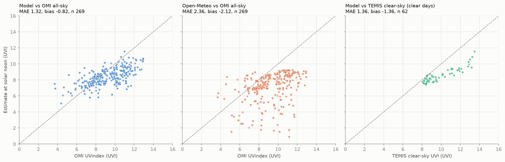
*รูปที่ 7 UVI ตอนเที่ยงปี 2025 เทียบ OMI และ TEMIS (test) `[docs/figures/test2025_noon_scatter.png]`*

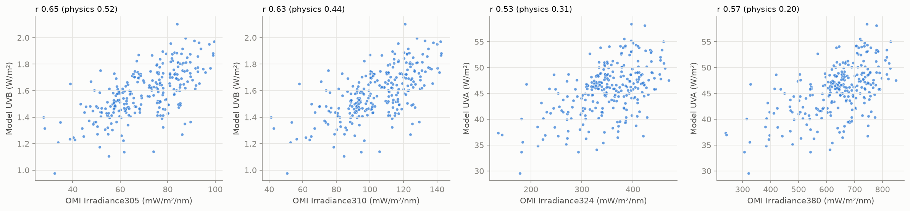
*รูปที่ 8 UVA/UVB ที่ทำนายเทียบ OMI irradiance 305/310/324/380 nm ซึ่งเป็นที่มาของ T4 ที่ไม่ผ่าน `[docs/figures/test2025_irradiance.png]`*

### 4.4 พยากรณ์: LSTM ไม่ผ่านเกณฑ์ จึงใช้ XGBoost

**ตาราง J** `[source_code/models/lstm_v1_metrics.json]`, `[docs/lstm_baseline_dev_2024.csv]`, `[docs/lstm_test_2025.json]`

| | ค่า | เกณฑ์ | ผ่าน |
|---|---|---|---|
| dev 2024: MAE ของ LSTM (3 seeds) | 0.463 ± 0.007 | < B1 − 0.02 = 0.430 | **❌** |
| dev 2024: recall ≥ สูงมาก | 0.873 (B1 0.831) | ≥ B1 − 0.03 = 0.801 | ✅ |
| test 2025 L1: MAE ของ LSTM | 0.497 ± 0.004 | < 1.0 | ✅ |
| test 2025 L2: เทียบ XGBoost final (0.480) | 0.497 | < 0.480 − 0.02 | **❌** |

- **เทียบ baseline:** บน dev, B1 XGBoost + features Open-Meteo ได้ 0.450 และ B2 Open-Meteo `uv_index` ได้ 1.162
- **LSTM แย่กว่า B1 ทุก lead:** bias +0.168 `[docs/results_summary.md §4]`, `[ROADMAP.md วัน 12]`
- **บน test 2025:** recall รุนแรงมากของ LSTM 0.06 เทียบกับ XGBoost 0.22 และตอน refit early stopping หยุดที่ epoch 5 / 1 / 1 `[ROADMAP.md วัน 12]`
- **ข้อสรุป: LSTM ไม่ชนะตามเกณฑ์ที่ประกาศไว้** แอปจึงใช้ XGBoost ทั้งค่าปัจจุบันและพยากรณ์ 6–24 ชม. และไม่ได้ปรับ LSTM ต่อ

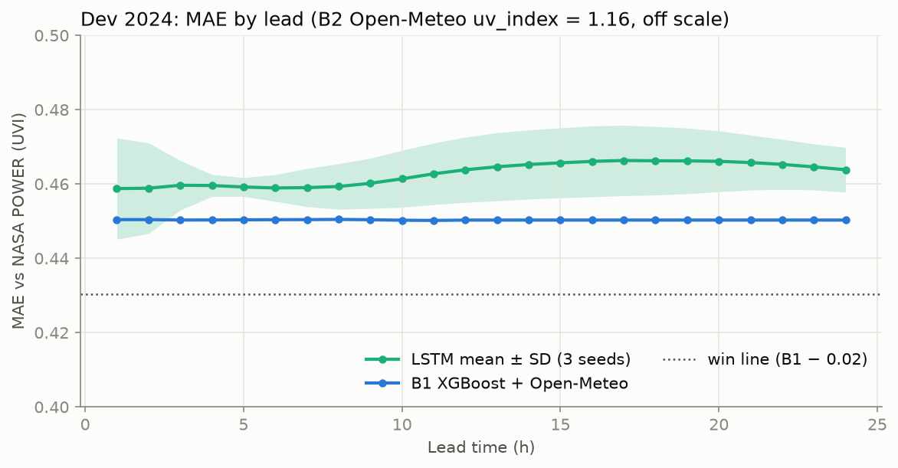
*รูปที่ 9 MAE ของ LSTM เทียบ baseline ตามระยะพยากรณ์ (dev 2024) `[docs/figures/lstm_dev_by_lead.png]`*

### 4.5 Sky CNN: ผ่าน 7 จาก 10 ข้อ (CCSN ไม่ผ่าน)
ประกาศเกณฑ์ไว้ใน commit `12c1828` และประเมิน test ครั้งเดียว

**ตาราง K** `[docs/sky_cnn_test.json]` (ค่าเฉลี่ย ± SD ของ 3 seeds)

| # | เกณฑ์ | ค่า | ผ่าน |
|---|---|---|---|
| **K1** | **CCSN 11 คลาส accuracy ≥ 0.60** (ตัด conflict, n 326) | **0.486 ± 0.010** | **❌** |
| **K2** | **CCSN macro-F1 ≥ 0.55** | **0.452 ± 0.023** | **❌** |
| **K3** | **CCSN 4 กลุ่ม UV accuracy ≥ 0.75** | **0.685 ± 0.009** | **❌** |
| K4 | recall เมฆบางระดับสูง ≥ 0.70 | 0.707 | ✅ (เฉียดฉิว) |
| K5 | CCSN accuracy − baseline สี (0.242) ≥ 0.10 | +0.243 | ✅ |
| S1 | SWIMCAT-ext accuracy รายภาพ ≥ 0.85 (311 ภาพ) | 0.975 ± 0.007 | ✅ |
| S2 | SWIMCAT-ext accuracy รายกลุ่ม ≥ 0.80 (181 กลุ่ม) | 0.967 ± 0.010 | ✅ |
| S3 | รายกลุ่ม − baseline สี (0.818) ≥ 0.05 | +0.149 | ✅ |
| R1 | red/blue: median สัดส่วนเมฆของ clear_sky < 0.20 | 0.001 | ✅ |
| R2 | red/blue: thick_white, thick_dark, veil > 0.60 | ต่ำสุด 0.656 | ✅ |

- **CCSN ไม่ผ่านทั้ง 3 เกณฑ์หลัก (K1–K3):** recall กลุ่มเมฆระดับกลาง 0.366 และเมฆก้อน 0.413 `[docs/results_summary.md §5]`
- **ผลต่อแอป:** วัน 18 ตัดสินว่า**ไม่แสดงชนิดเมฆ/กลุ่ม UV ของ CCSN ในแอป** และ `/sky-image` ส่งเฉพาะสภาพท้องฟ้า SWIMCAT-ext (6 คลาส) `[ROADMAP.md วัน 18]`
- **ตรวจภาพซ้ำข้าม dataset:** กฎจับได้ 11 คู่ แต่เมื่อดูภาพจริงไม่มีคู่ไหนเป็นภาพเดียวกัน ผลหลักไม่เปลี่ยน `[docs/sky_cnn_crosscheck.json]`

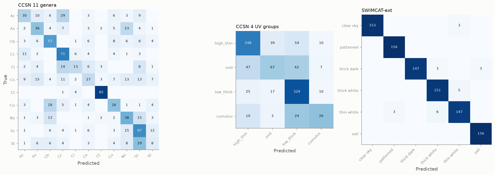
*รูปที่ 10 confusion matrix ของ sky CNN บน test split `[docs/figures/sky_cnn_confusion.png]`*

### 4.6 Head สัดส่วนเมฆจาก SWIMSEG: ผ่าน 2 จาก 2 ข้อ

**ตาราง L** `[docs/sky_cloud_test.json]`, `[source_code/models/sky_cloud_v1_metrics.json]`

| # | เกณฑ์ (SWIMSEG test, 141 ภาพ / 5 วัน) | ค่า | ผ่าน |
|---|---|---|---|
| C1 | MAE เฉลี่ย 3 seeds ≤ 0.10 | 0.084 ± 0.0015 | ✅ |
| C2 | MAE ของ red/blue (0.145) − MAE ของ CNN ≥ 0.03 | +0.061 | ✅ |

- **ตัวเลขอื่น:** RMSE 0.103 (red/blue 0.188), bias −0.012 MAE รายวันของ CNN 0.041–0.097 เทียบกับ red/blue 0.117–0.209 คือ CNN ดีกว่าทุกวันทั้ง 5 วัน
- **ข้อจำกัด:** CNN ดึงค่าเข้าหาค่ากลาง และ test มีภาพเมฆ < 20 % แค่ 7 ภาพ, > 80 % แค่ 9 ภาพ `[docs/results_summary.md §5]`
- **ในแอป:** แสดงเป็นระดับ น้อย/ปานกลาง/มาก พร้อมข้อความ "สัดส่วนเมฆในภาพ ไม่ใช่ทั้งท้องฟ้า" `[ROADMAP.md ส่วนเสริม]`

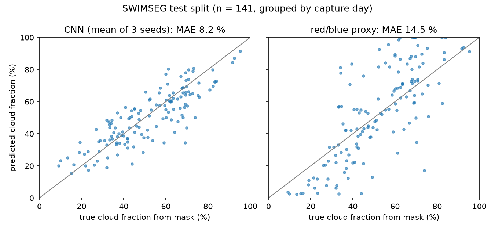
*รูปที่ 11 สัดส่วนเมฆที่ CNN และ red/blue ทำนายเทียบกับ mask ของ SWIMSEG (test) `[docs/figures/sky_cloud_test_scatter.png]`*

### 4.7 ระบบซอฟต์แวร์

**ผลเทสอัตโนมัติ** (รันล่าสุดเมื่อ 4 ต.ค. 2026 เวลาไทย ผลจากการรันจริง ไม่ได้มาจากไฟล์ในโปรเจกต์ pytest รันหลัง `c6b05db` ซึ่งไม่ได้แก้โค้ด Python หลังจากนั้น):

| ชุดเทส | ผล | เวลาที่รัน |
|---|---|---|
| pytest (`pytest` ที่ `Final-Project/`) | **402 passed** (263.32 วินาที) | 15:38–15:43 |
| Jest (`npx jest` ที่ `source_code/app/`) | **329 passed, 29 suites** | 16:42 (หลังแก้บั๊กข้อ 4 ในตาราง Q) |

`tsc --noEmit` และ `expo lint` ผ่าน (รันหลังแก้บั๊กข้อ 4 ในตาราง Q วันเดียวกัน)

**ตรวจกับ API จริง (Checkpoint วัน 21):** uvicorn + PostgreSQL `[ROADMAP.md Checkpoint วัน 21]`

| คำขอ | ผล | หมายเหตุ |
|---|---|---|
| `/health` | 200 | 5 โมเดล |
| `/predict` ปทุมธานี | 200 | 2.3 วินาที |
| `/predict` เชียงใหม่ | 200 | มี note "ความแม่นยำนอกพื้นที่ปทุมธานียังไม่ได้ประเมิน" |
| `/predict` โตเกียว | 422 | 0.003 วินาที ไม่ได้เรียก Open-Meteo |

**Smoke test 27 ก.ย. 2026 ~13:10 (ปทุมธานี):** UVI 5.49 [4.94, 6.66] ส่วน `uv_index` ของ Open-Meteo ชั่วโมงเดียวกันได้ 2.95 (เมฆ 100 %) เป็นการสังเกตครั้งเดียว ไม่ใช่ผลความแม่นยำ `[ROADMAP.md วัน 16]`

**Push จากเซิร์ฟเวอร์:** ตรวจ cooldown, hysteresis, ช่วงเงียบ, `DeviceNotRegistered` และ retry ด้วย**ตัวส่งปลอม (fake sender)** ใน pytest เท่านั้น ยังไม่ได้รับ push จริงบนมือถือ เพราะต้องใช้ build ที่มี Firebase/FCM `[ROADMAP.md วัน 23]`

### 4.8 ทดสอบบนมือถือจริง

**ผลที่บันทึกแล้ว (Samsung, Android, Expo Go):**

| วันที่ | สิ่งที่ทดสอบ | ผล |
|---|---|---|
| 28 ก.ย. | หน้าหลัก | UVI, ช่วง q10–q90, UVA/UVB, เวลาผิวไหม้, disclaimer ถูกต้อง |
| 28 ก.ย. | กราฟรายชั่วโมง | รูประฆัง สูงสุด 8.3 ตอน 12:00 `[ROADMAP.md วัน 18–19]` |
| 1 ต.ค. | กล้อง | ส่งรูปไป `/sky-image` ได้ ป้ายมุมต่ำทำงาน (ถ่ายที่ −5°) **แต่ภาพมุมต่ำที่มีสิ่งอื่นในภาพ โมเดลยังตอบด้วยความมั่นใจ 100 %** ความมั่นใจของโมเดลจึงใช้บอกความน่าเชื่อถือกับภาพนอกการกระจายของข้อมูลฝึกไม่ได้ `[ROADMAP.md วัน 20]` |
| 1 ต.ค. | หน้าจอแจ้งเตือน (ไม่มีแจ้งเตือนเด้ง เพราะ Expo Go Android ใช้ไม่ได้) | 13:00 UVI 8.0 (6.6–9.0) · กด "ออกแดด" 13:16 → "จะถึงประมาณ 80 % ของ MED ราว 13:37" · "ทาครีมแล้ว" → "ควรทาครีมซ้ำราว 15:16" `[ROADMAP.md วัน 22]` |

**ตาราง M** บั๊ก 3 ตัวที่เจอหลังเทสอัตโนมัติผ่านหมดแล้ว

| บั๊ก | เจอที่ไหน | อาการ | สาเหตุ | แก้ / เทสที่กันไว้ |
|---|---|---|---|---|
| **FormData** (วัน 20) | มือถือจริง, Expo Go Android, 29 ก.ย. | กด "ถ่ายและวิเคราะห์" แล้วขึ้น "เชื่อมต่อเซิร์ฟเวอร์ไม่ได้" รายละเอียด "Unsupported FormDataPart implementation" และ API ไม่ได้รับ request | SDK 57 บน native ใช้ `expo/fetch` ซึ่งรับ FormData ได้แค่ string, Blob หรือ object ที่มี `bytes()` แต่แอปแนบแบบ `{ uri, name, type }` | แนบ `File` ของ `expo-file-system` แทน และแยก error ขั้น `prepare` ออกจาก network error · `skyUpload.test.ts` รันตัวแปลงจริงของ expo (โค้ดเดิม fail) ส่วนเทสเดิมผ่านเพราะใช้ fetch ปลอม · commit `a24f86b` `[ROADMAP.md วัน 20]` |
| **expo-notifications** (วัน 22) | มือถือจริง, Expo Go Android, 29 ก.ย. | เปิดแอปแล้วขึ้น "Uncaught Error: expo-notifications: Android Push notifications … was removed from Expo Go with the release of SDK 53" ทั้งแอป | ใน 57.0.21 `index.js` re-export โมดูลที่เรียก `addPushTokenListener` ตั้งแต่ตอน import และ throw บน Android ทำให้แค่ import ก็พัง บั๊กอยู่ตั้งแต่ commit `eb0a433` แต่ Jest ไม่เจอเพราะ mock โมดูลทั้งตัว | โหลด `expo-notifications` แบบ lazy จากไฟล์เดียว (`src/lib/notifications.ts`) ถ้าไม่มีโมดูลก็ปิดสวิตช์เฉพาะบนจอ · `expoGoImport.test.tsx` (ลองย้อนโค้ดแล้ว fail 13/14) · commit `8f2d0ef` `[ROADMAP.md วัน 22]` |
| **package-lock.json** (วัน 24) | **ตอน EAS build #1 ไม่ใช่บนมือถือ** (build จาก commit `956e8f9`) | `npm ci` EUSAGE "Missing: @emnapi/core@1.11.3 / @emnapi/runtime@1.11.3 from lock file" | npm 11.6.2 บนเครื่องไม่ใส่ peer deps ของ `@napi-rs/wasm-runtime` (optional) ไว้ระดับบนสุดของ lock แต่ npm 10.8.2, 10.9.2 และ 11.4.2 ต้องการให้มี | เพิ่ม 2 รายการลง lock เอง (+25 บรรทัด ไม่มีแพ็กเกจอื่นเปลี่ยนเวอร์ชัน) วันที่ 2 ต.ค. · `__tests__/lockfile.test.ts` + ตรวจด้วย `npx -y npm@10.9.2 ci --dry-run` `[source_code/app/README.md หัวข้อ EAS development build]` |

**บทเรียน:** บั๊กทั้ง 3 ตัวผ่านเทสอัตโนมัติมาแล้ว เพราะเทส mock ส่วนที่พังจริง (fetch, native module) หรือรันด้วย npm คนละเวอร์ชันกับเครื่อง build การทดสอบบนมือถือจริงและบนเครื่อง build จึงจำเป็น

#### ทดสอบภาคสนามด้วย development build วันที่ 4 ต.ค. 2026
ที่มาของทุกตัวเลขในหัวข้อนี้: `[บันทึกภาคสนาม 4 ต.ค. 2026 ของผู้ทดสอบ]` (เช็กลิสต์ `docs/field_test_2026-10-04.md`)

**ตาราง N** เงื่อนไขการทดสอบ

| หัวข้อ | ค่า |
|---|---|
| มือถือ | Samsung Galaxy S23 Ultra, Android 16 (One UI 8.5) |
| build | EAS development build `791d5b3f` (จาก commit `da9057a`) โหลด JS ผ่าน Metro จากโค้ดในเครื่อง ณ เวลาทดสอบ |
| การแจ้งเตือน | แจ้งเตือนในเครื่อง (local) เท่านั้น ไม่มี FCM |
| สถานที่ / ช่วงเวลา / ผู้ทดสอบ | ปทุมธานี สถานที่เดียว วันเดียว ผู้ทดสอบคนเดียว |
| ท้องฟ้า | เมฆบางส่วน |
| ผู้ใช้ | ผิวประเภท III (MED 350 J/m²) เกณฑ์เตือน "สูงมาก (8+)" |
| โหมดประหยัดพลังงาน | ไม่ได้จด |

**ตาราง O** แจ้งเตือนในเครื่อง (เวลาที่ตั้ง → เวลาที่ได้รับ)

| แจ้งเตือน | ตั้ง | ได้รับ | ช้า | หมายเหตุ |
|---|---|---|---|---|
| UV สูง | 10:00 | 10:06 | 6 นาที | |
| ทาครีมซ้ำ | 11:52 | 11:54 | 2 นาที | |
| UV ลดลงแล้ว | 15:00 | 15:09 | 9 นาที | ข้อความ "ค่าประมาณ UVI 2.6 (ค่าบน 3.0) ต่ำกว่า 6 แล้ว" |
| เตือนผิวไหม้ รอบ 1 | 10:31 | ไม่ได้รับ | — | สรุปสาเหตุไม่ได้ (ดูบั๊กข้อ 2 ในตาราง Q) |
| เตือนผิวไหม้ รอบ 2 | ไม่ได้จด (ตามสูตรราว 11:40) | 11:51 | ราว 11 นาที (ยังไม่ยืนยัน) | เริ่มออกแดด 11:21 |
| สรุป 07:00 | — | — | — | ไม่ได้ทดสอบ |

**สรุป:** 3 รายการที่ยืนยันเวลาได้ มาช้า 2–9 นาที เฉลี่ย 5.7 นาที สาเหตุที่เป็นไปได้คือแอปไม่ได้ขอสิทธิ์ `SCHEDULE_EXACT_ALARM` และโหมดประหยัดพลังงาน (ข้อจำกัดข้อ 11)

**ตาราง P** ค่าที่แอปแสดง และการตรวจสูตร

| เวลา | ค่าที่แอปแสดง |
|---|---|
| 10:06 | UVI 7.1 (q10–q90 6.0–8.1) |
| 12:00 | UVI 8.7 (7.4–9.7) เวลาก่อนผิวไหม้ 24 นาที |
| 13:39 | เวลาก่อนผิวไหม้ 27 นาที, UVA 45.8 W/m², UVB 1.49 W/m² |

- **ตรวจสูตรเวลาเตือน 80 % ของ MED:** กดออกแดด 10:08 แอปบอกจะเตือน 10:31 ตรงกับ 280 J/m² ÷ (8.1 × 0.025 W/m²) ≈ 23 นาที
- **ตรวจสูตร % ของ MED:** ตอน 12:00 แอปแสดง 160 % ของ MED สูตรได้ 162 %
- **ความแม่นยำของ UVI ในวันทดสอบ: ประเมินไม่ได้** เพราะไม่มีเครื่องวัด UV ภาคพื้น และไม่ได้เทียบกับ Open-Meteo ณ เวลาและที่เดียวกัน

**ตาราง Q** บั๊กที่พบวันที่ 4 ต.ค. และแก้แล้ว (ข้อ 1–3 ใน commit `c6b05db`, ข้อ 4 ใน `d2b1762`)

| # | อาการ | แก้ |
|---|---|---|
| 1 | การ์ด "อยู่กลางแจ้ง" แสดง % ของ MED ค้างหลังกลับจากล็อกจอ (10:33 แสดง 79 % สูตรได้ 87 %) | hook `useNow` (คำนวณใหม่ทุก 30 วินาที และทันทีที่แอปกลับมา active) |
| 2 | แจ้งเตือนที่เลยเวลาแต่ยังไม่ถูกส่ง ถูกยกเลิกเมื่อ sync ใหม่ | เก็บไว้ไม่เกิน 30 นาที (`MAX_OVERDUE_MS`) ถ้ายังมีเหตุผลให้ส่ง |
| 3 | หน้าหลักยังแสดงชั่วโมงเก่าเมื่อข้ามชั่วโมง (12:00 ยังแสดง 11:00–12:00) | เรียก `/predict` ใหม่เมื่อเปลี่ยนชั่วโมง ถ้าล้มเหลวเก็บค่าเดิมพร้อมป้ายบอก และไม่ใช้คำว่า "ตอนนี้" กับข้อมูลชั่วโมงเก่า |
| 4 | เตือนผิวไหม้ข้ามวัน: 15:37 ที่ค่าบน (q90) 3.0 กด "ออกแดด" แล้วการ์ดแสดง "จะเตือนราว 08:06" ซึ่งเป็น 08:06 ของวันถัดไป เพราะสะสมปริมาณ UV ข้ามคืน | นับปริมาณ UV เฉพาะช่วงที่มีแดดของวันที่เริ่ม (`sunEndMs`) ถ้าไม่ถึง 80 % ก่อนแดดหมด การ์ดแสดง "วันนี้ UV ไม่พอจะถึง 80 % ของ MED ก่อนแดดหมด จึงไม่ตั้งเตือน" ไม่ตั้งแจ้งเตือน และยกเลิกแจ้งเตือนผิวไหม้ที่ตั้งไว้ข้ามวันตอน sync (`sunDoseDay.test.tsx`) |

- **การยืนยันบนเครื่องจริงหลังแก้ข้อ 1–3:** 15:37–15:39 ใน development build % ของ MED เปลี่ยนจาก 0 เป็น 2 % (สูตรได้ 2.6 %) และระบบแจ้งเตือนยังใช้ได้ ระหว่างนั้นมือถือล็อกจอหรือไม่: ไม่ได้จด ส่วนเตือนผิวไหม้หลังแก้บั๊ก ไม่ได้ทดสอบ
- **การยืนยันบั๊กข้อ 4 หลังแก้:** ไม่ได้จด (ยืนยันด้วย Jest)
- **จุดที่ยังไม่มีเทส:** กรณี `load()` reject และการกด "ลองใหม่" หลังรีเฟรชอัตโนมัติล้มเหลว

**กล้องและความเป็นส่วนตัว**
- อัปโหลดภาพสำเร็จ 2 ภาพ log ของ API แสดง `has_exif=False` ทั้ง 2 ภาพ
- CNN ให้ "เมฆบางสีขาว 100 %" ทั้ง 4 จาก 4 ภาพจากมือถือ (1 ต.ค. 2 ภาพ, 4 ต.ค. 2 ภาพ) ขณะที่ท้องฟ้าจริงวันที่ 4 ต.ค. เป็นเมฆบางส่วน สงสัยว่าเป็น domain shift แต่จำนวนภาพน้อยเกินกว่าจะสรุป และ CNN ไม่เปลี่ยนค่า UVI
- ป้ายมุมต่ำ: ภาพที่ 1 ถ่ายที่มุมเงยประมาณ 28° แอปแสดงป้าย "ถ่ายที่มุมเงยประมาณ 28° (ต่ำกว่า 30°) อาจมีตึกหรือต้นไม้ในภาพ ผลนี้ไม่น่าเชื่อถือ" (รูปที่ 12 ฉ) ภาพที่ 2 ไม่มีป้าย ส่วนข้อความ error ของกล้องในรอบนี้: ไม่ได้จด `[docs/screenshots/06_sky_camera.jpg]`

**ค่าแสงจากเซนเซอร์มือถือ** (ยังไม่ปรับเทียบ ใช้ดูเท่านั้น หงายจอ เอียง 7–12°)

| สภาพ | lux |
|---|---|
| กลางแดด | 19,321 |
| ร่มไม้ | 1,082 |
| ใต้หลังคา | 154 |
| ในบ้าน | 0 ตอน 12:09 (ทำซ้ำไม่ได้) และ 207 ตอนวัดอีกครั้ง 13:20 |

ข้อความทิศทางที่แอปแสดง: "ทิศทางถูกต้อง: หน้าจอหงายขึ้นฟ้า" ทุกค่าในตาราง (อ่านจากภาพหน้าจอ เช่น รูปที่ 12 ช)

**อื่น ๆ**
- ใน Expo Go แอปแสดงข้อความว่าไม่มีแจ้งเตือน และบอกเวลาบนจอแทน (ตรวจ 13:39)
- **ไม่ได้ทดสอบ:** push จากเซิร์ฟเวอร์บนเครื่องจริง (ทดสอบด้วย FakeSender เท่านั้น), iOS, ขั้นตอนขอสิทธิ์ตำแหน่ง 4 กรณี (วัน 21), เตือนผิวไหม้หลังแก้บั๊ก
- **ไม่ได้จด:** ตรวจสวิตช์แจ้งเตือนและ channel 2 ช่องใน dev build, ไม่อนุญาตแจ้งเตือน, "ลบข้อมูลของฉัน"

#### ภาพหน้าจอจากมือถือจริง (4 ต.ค. 2026)

<table>
<tr><td>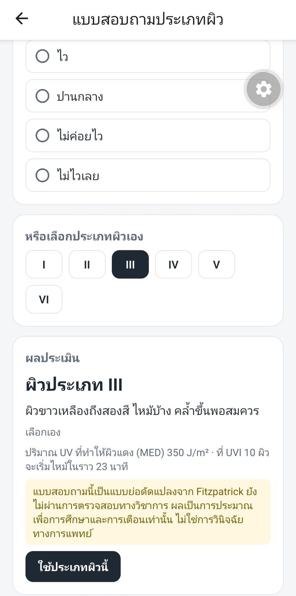<br>(ก) แบบสอบถามประเภทผิว ผลประเมิน: ผิวประเภท III</td><td>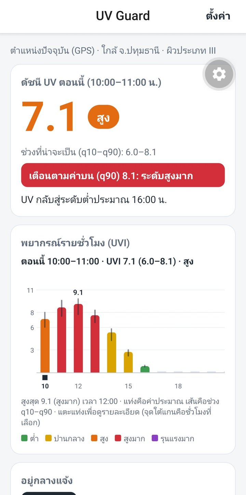<br>(ข) หน้าหลัก 10:06 UVI 7.1 (6.0–8.1) และแถบเตือนตามค่าบน (q90) 8.1</td><td>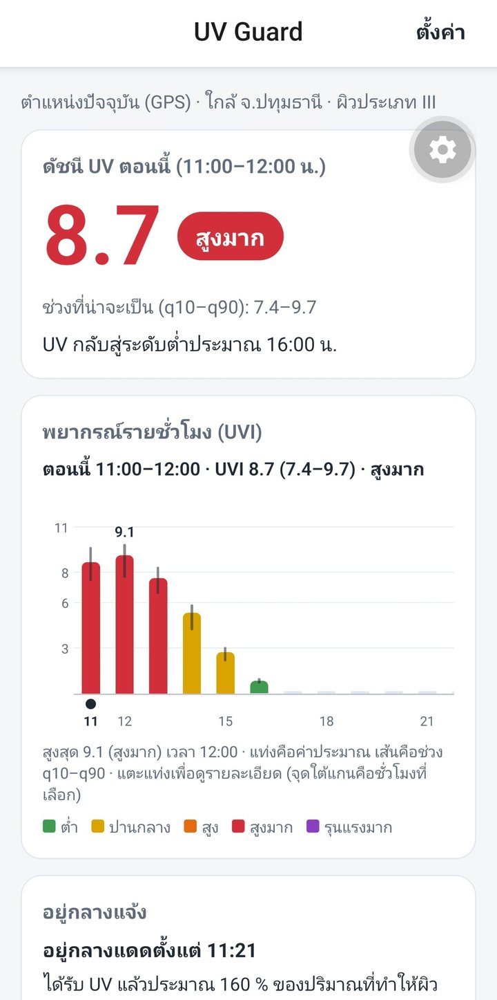<br>(ค) หน้าหลัก 12:00 UVI 8.7 (7.4–9.7) และกราฟรายชั่วโมง</td><td>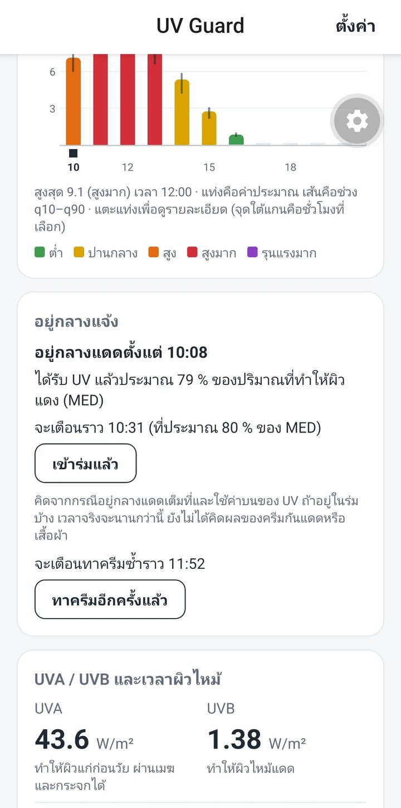<br>(ง) การ์ด "อยู่กลางแจ้ง" 10:33 ก่อนแก้บั๊กข้อ 1 ค่า 79 % เป็นค่าที่ค้าง</td></tr>
<tr><td>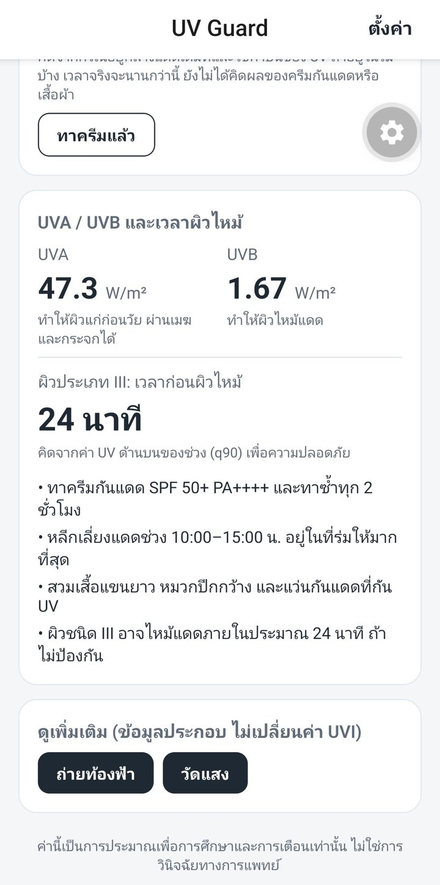<br>(จ) UVA/UVB เวลาก่อนผิวไหม้ 24 นาที และคำแนะนำ</td><td>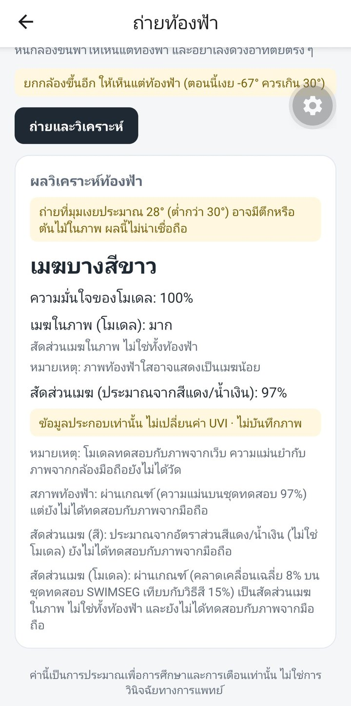<br>(ฉ) ผลวิเคราะห์ท้องฟ้า พร้อมป้ายมุมต่ำ 28°</td><td>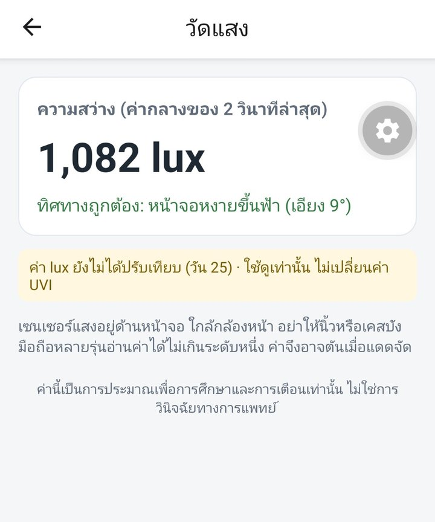<br>(ช) วัดแสง ร่มไม้ 1,082 lux</td><td>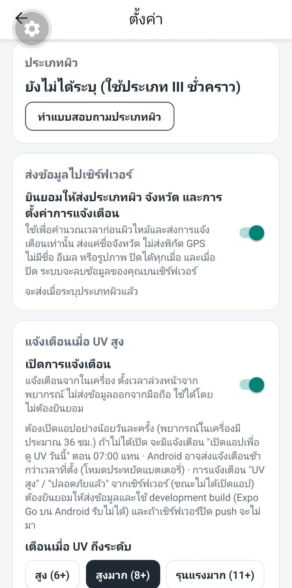<br>(ซ) ตั้งค่า: ความยินยอมส่งข้อมูล และเกณฑ์เตือน</td></tr>
<tr><td colspan="2">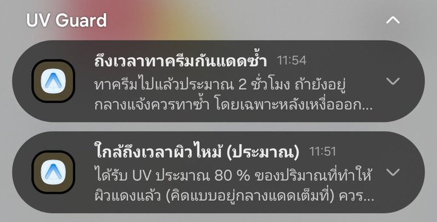<br>(ฌ) แจ้งเตือน "ทาครีมซ้ำ" 11:54 และ "ใกล้ถึงเวลาผิวไหม้" 11:51</td><td colspan="2">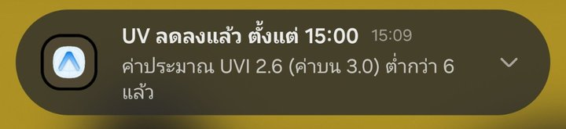<br>(ญ) แจ้งเตือน "UV ลดลงแล้ว ตั้งแต่ 15:00" ได้รับ 15:09</td></tr>
</table>

*รูปที่ 12 ภาพหน้าจอแอป UV Guard จาก Samsung Galaxy S23 Ultra วันที่ 4 ต.ค. 2026 ตัดแถบสถานะของมือถือออก ปุ่มเฟืองสีเทาที่ลอยอยู่เป็นปุ่มเครื่องมือของ development build ไม่ใช่ส่วนของแอป ค่า UVI ในแต่ละภาพเป็นค่าพยากรณ์ ณ เวลาที่แคป ภาพ (ค) แคปตอน 12:00 หัวการ์ดยังเป็นชั่วโมง 11:00–12:00 ซึ่งคือบั๊กข้อ 3 ในตาราง Q* `[docs/screenshots/]`

---

## 5. ข้อจำกัด

1. **ฝึกและทดสอบด้วยข้อมูลปทุมธานีที่เดียว:** target ของ NASA POWER มาจากจุดกริดเดียว (14.02N 100.52E) และ ozone climatology ก็สร้างสำหรับจุดนั้น แอปใช้ GPS หรือ 77 จังหวัดได้ แต่**ยังไม่ได้ประเมินความแม่นยำนอกปทุมธานี** API จะแนบ note เมื่อห่างเกิน 50 กม. และตอบ 422 นอกกรอบประเทศไทย ซึ่งเป็นกรอบสี่เหลี่ยมคร่าว ๆ บางพื้นที่ชายแดนของประเทศเพื่อนบ้านจึงยังผ่าน test มีแค่ปีเดียว (2025) `[docs/results_summary.md §6 ข้อ 8–9]`
2. **Ground truth เป็น NASA POWER ไม่ใช่เครื่องวัดภาคพื้นดิน:** เป็นผลิตภัณฑ์ดาวเทียม/แบบจำลองบนกริดหยาบ ข้อมูลตรวจสอบเป็น OMI (1°, วันละครั้ง) และ TEMIS (มีแค่ฟ้าใสที่กรุงเทพฯ) โมเดลรับ bias ต่ำของ NASA มาด้วย: วันฟ้าเปิดต่ำกว่า TEMIS 1.36 UVI (NASA −1.58) และค่าตอนเที่ยงแทบไม่เกิน ~11 ในขณะที่ TEMIS แสดง 12–13 **การเตือนจึงอาจบอกค่าสูงสุดต่ำกว่าจริง** `[docs/results_summary.md §6 ข้อ 1–2]`
3. **โมเดลท้องฟ้ายังไม่ได้วัดผลกับภาพจากมือถือ:**
   - test ทั้งหมดเป็นภาพจาก dataset สาธารณะ: CCSN (กล้องธรรมดา), SWIMCAT-ext (ภาพจากอินเทอร์เน็ต), SWIMSEG (กล้องถ่ายทั้งท้องฟ้าที่สิงคโปร์ 17 วัน)
   - ค่าที่ได้คือสัดส่วนเมฆ**ในภาพ** ไม่ใช่ทั้งท้องฟ้า
   - บนมือถือพบว่าความมั่นใจ 100 % กับภาพนอกการกระจายของข้อมูลฝึก (1 ต.ค.) และภาพจากมือถือทั้ง 4 ภาพได้ "เมฆบางสีขาว 100 %" ขณะที่ท้องฟ้าวันที่ 4 ต.ค. เป็นเมฆบางส่วน (ตาราง N–Q, §4.8)
   - CCSN ไม่ผ่าน K1–K3 และมี label ขัดกัน 263 ภาพ
   - history ราย epoch ของ seed 42/43 หายเพราะ crash

   `[docs/results_summary.md §6 ข้อ 7]`, `[ROADMAP.md วัน 14, 20]`
4. **Remote push ทดสอบด้วยตัวส่งปลอมเท่านั้น:**
   - ยังไม่ได้รับ push จริงบนมือถือ เพราะต้องใช้ EAS build ที่มี Firebase/FCM
   - แอปตรวจว่า push ใช้ได้เฉพาะตอนเปิดแอป ถ้าเซิร์ฟเวอร์ปิดหลังจากนั้น push จะไม่มา (และไม่มี local "UV สูง") จนกว่าจะเปิดแอปครั้งถัดไป
   - Expo Go บน Android ใช้การแจ้งเตือนไม่ได้เลย

   `[ROADMAP.md วัน 22–23]`
5. **ไม่ใช่เครื่องมือแพทย์:** ผลเป็นค่าประมาณเพื่อการศึกษาและการเตือน แบบสอบถามผิว 5 ข้อยังไม่ผ่านการตรวจสอบทางวิชาการ และเวลาผิวไหม้คิดจากกรณีอยู่กลางแดดเต็มที่ ยังไม่รวมผลของครีมกันแดดและเสื้อผ้า `[docs/skin_quiz.md]`, `[ROADMAP.md วัน 22]`

**ข้อจำกัดอื่นที่บันทึกไว้:**
6. **UVA/UVB:** r กับ OMI irradiance ต่ำกว่าเป้า 0.7 (T4) และ UVB ของ SPECTRL2 ครอบคลุมแค่ 300–315 nm `[docs/results_summary.md §6 ข้อ 3]`
7. **การเตือน:** ชั่วโมงระดับรุนแรงมากมีน้อย (23 ชม. ในปี 2025) recall จึงไม่แน่นอน (95 % CI 0.63–0.93 `[notebook 10_test_2025.ipynb ข้อ 4 ผ่าน ROADMAP.md วัน 10 · ไม่มีไฟล์ผลลัพธ์ให้ตรวจซ้ำ]`) precision ระดับรุนแรงมาก 0.17 และเตือน ≥ สูงมากผิด 16 % `[docs/results_summary.md §6 ข้อ 4]`
8. **ผล dev 2024 หลังวัน 8 มองโลกในแง่ดีเกินจริง** test 2025 เป็นค่าที่ไม่ลำเอียง `[docs/results_summary.md §6 ข้อ 5]`
9. **Features ของพยากรณ์:** ข้อมูลฝึกมาจาก Historical Forecast API ซึ่งเป็นช่วงต้นของแต่ละรอบพยากรณ์มาต่อกัน ไม่ใช่พยากรณ์ล่วงหน้า 24 ชม. จริง ผลตอนพยากรณ์จริงอาจแย่กว่าที่วัดได้ `[docs/results_summary.md §6 ข้อ 6]`
10. **ก่อนวัน 6 เคยใช้ข้อมูลปี 2025 ใน EDA และ ozone climatology v1** (แก้เป็น v2 แล้ว และไม่ได้ใช้เลือกโมเดล) `[ROADMAP.md วัน 6]`
11. **แจ้งเตือนที่ตั้งเวลาไว้มาช้า** เพราะไม่ขอสิทธิ์ `SCHEDULE_EXACT_ALARM` และ Android Doze / โหมดประหยัดพลังงาน วันที่ 4 ต.ค. วัดได้ช้า 2–9 นาที เฉลี่ย 5.7 นาที (3 รายการที่ยืนยันได้ ตาราง O) และแจ้งเตือนผิวไหม้รอบ 1 ไม่ได้รับ `[source_code/app/README.md]`, `[บันทึกภาคสนาม 4 ต.ค. 2026 ของผู้ทดสอบ]`
12. **เซนเซอร์แสงยังไม่ได้ปรับเทียบ** และยังไม่มีตัวแยก "กลางแดด/ในร่ม" หรือ export CSV ในแอป ค่า lux ไม่เปลี่ยน UVI ค่าที่วัดได้ใช้ดูเท่านั้น และค่าในบ้านไม่คงที่ (0 แล้ว 207 lux) `[ROADMAP.md วัน 20, 25]`, `[บันทึกภาคสนาม 4 ต.ค. 2026 ของผู้ทดสอบ]`
13. **License:** SWIMCAT-ext และ SWIMSEG ใช้เพื่อการศึกษาและไม่ใช่เชิงพาณิชย์เท่านั้น `[docs/datasets.md]`
14. **ทดสอบภาคสนามจำกัดมาก:** สถานที่เดียว วันเดียว ผู้ทดสอบคนเดียว มือถือรุ่นเดียว (Android) ไม่มีเครื่องวัด UV ภาคพื้นและไม่ได้เทียบกับ Open-Meteo จึงประเมินความแม่นยำของ UVI ในวันทดสอบไม่ได้ `[บันทึกภาคสนาม 4 ต.ค. 2026 ของผู้ทดสอบ]`
15. **session "ออกแดด" ไม่สิ้นสุดเองเมื่อข้ามวัน:** ปริมาณ UV หยุดนับเมื่อแดดหมด แต่ session ยังค้างอยู่จนผู้ใช้กด "เข้าร่มแล้ว" เอง `[source_code/app/src/lib/dose.ts]`
16. **ตัวเลขบางส่วนตรวจซ้ำกับไฟล์ผลลัพธ์ไม่ได้:** ช่วงความเชื่อมั่น 95 % ของ recall ระดับรุนแรงมาก (0.63–0.93), ผลของโอโซนคงที่ 300 DU (−15.2 %) และอัตราส่วน NASA POWER ต่อ Madronich ในชั่วโมงฟ้าเปิด (0.72) มาจาก notebook และ ROADMAP ไม่มีไฟล์ผลลัพธ์ให้ตรวจซ้ำ
17. **ค่า MED ของผิวแต่ละประเภทยังไม่มีแหล่งอ้างอิง:** ค่า 200–1000 J/m² ที่ใช้คำนวณเวลาก่อนผิวไหม้และ % ของ MED เป็นค่าที่โปรเจกต์กำหนด ยังไม่ได้ระบุแหล่งที่มา และ MED ของแต่ละคนต่างกันได้มากแม้ผิวประเภทเดียวกัน เวลาที่แอปแสดงจึงเป็นค่าประมาณเท่านั้น `[source_code/src/risk.py]`

---

## 6. งานต่อยอด
1. **ข้อมูลวัด UV ภาคพื้นดิน:** ติดต่อขอข้อมูลที่นครปฐม (ม.ศิลปากร) มาใช้เป็น ground truth แทนหรือเสริม NASA POWER `[ROADMAP.md ส่วนเสริม]`
2. **ข้อมูลเมฆจากดาวเทียม Himawari** (JAXA P-Tree) เป็น features ความหนาเมฆ `[ROADMAP.md ส่วนเสริม]`
3. **วัดผลพยากรณ์ตามระยะเวลาล่วงหน้าจริง** ด้วย Open-Meteo Previous Runs API `[ROADMAP.md วัน 11]`
4. **ฝึกและทดสอบหลายพื้นที่** (ภาคเหนือช่วงหมอกควัน, ภาคใต้ที่ฝนชุก) ก่อนเปิดให้ใช้นอกปทุมธานี `[docs/results_summary.md §6 ข้อ 9]`
5. **เก็บภาพท้องฟ้าจากมือถือพร้อม label** เพื่อวัดผล CNN และหาเกณฑ์ปฏิเสธภาพนอกการกระจายของข้อมูลฝึก (ภาพที่ใช้ในแอปตอนนี้ใช้ทำนายเท่านั้น ไม่ได้ใช้ฝึก)
6. **ปรับเทียบ lux** และทำ exposure factor "กลางแดด/ในร่ม" + export CSV `[ROADMAP.md วัน 25]`
7. **ทดสอบ push จริงผ่าน FCM (build #2) และ iOS development build** `[ROADMAP.md วัน 23–24]`
8. **ปรับปรุงการเตือนระดับรุนแรงมาก** (precision 0.17) เช่น ใช้ Q แยกตามระดับหรือตามเดือน เพราะ coverage ของ CQR ไม่สม่ำเสมอ `[ROADMAP.md วัน 9]`

---

## เอกสารอ้างอิง
รายการ 1–12 มาจากแหล่งที่บันทึกไว้ในโปรเจกต์ (ที่มาอยู่ในวงเล็บเหลี่ยม) รายการ 13–19 เพิ่มจากรายการที่ผู้จัดทำให้มาเมื่อ 4 ต.ค. 2026

**ข้อมูล UV และสภาพอากาศ**
1. NASA POWER, Hourly API, community RE: `https://power.larc.nasa.gov/api/temporal/hourly/point` `[source_code/src/fetch_data.py]`
2. Open-Meteo Historical Forecast API: `https://historical-forecast-api.open-meteo.com/v1/forecast` และ Air Quality API: `https://air-quality-api.open-meteo.com/v1/air-quality` `[source_code/src/fetch_data.py]`
3. Open-Meteo Forecast API: `https://api.open-meteo.com/v1/forecast` `[source_code/src/inference.py]`
4. Open-Meteo Geocoding API (ข้อมูลจาก GeoNames, CC BY 4.0): "Contains data from GeoNames (CC BY 4.0), via the Open-Meteo Geocoding API" `[docs/datasets.md]`
5. TEMIS UV index overpass, Bangkok: `https://d1qb6yzwaaq4he.cloudfront.net/uvradiation/v2.0/overpass/uv_Bangkok_Thailand.dat` `[source_code/src/fetch_validation.py]`
6. NASA OMI OMUVBd v003 (daily L3 1° grid) ดึงด้วย `earthaccess` จาก NASA GES DISC `[source_code/src/fetch_validation.py]`, `[ROADMAP.md วัน 1–2]`

**ภาพท้องฟ้า** `[docs/datasets.md]`

7. Zhang, J., Liu, P., Zhang, F., Song, Q. (2018). *CloudNet: Ground-based cloud classification with deep convolutional neural network.* Geophysical Research Letters 45, 8665–8672. Dataset: CCSN Database, Harvard Dataverse, doi:10.7910/DVN/CADDPD.
8. Hoang, V. T. (2020). *SWIMCAT-ext* [Dataset]. Mendeley Data, V1, doi:10.17632/vwdd9grvdp.1.
9. Dev, S., Lee, Y. H., Winkler, S. (2015). *Categorization of cloud image patches using an improved texton-based approach.* Proc. IEEE ICIP (SWIMCAT).
10. Dev, S., Lee, Y. H., & Winkler, S. (2017). Color-based segmentation of sky/cloud images from ground-based cameras. *IEEE Journal of Selected Topics in Applied Earth Observations and Remote Sensing*, 10(1), 231–242. (SWIMSEG)

**ซอฟต์แวร์และเอกสาร**

11. pvlib `pvlib.spectrum.spectrl2` (SPECTRL2) `[source_code/src/physics.py]`
12. Expo, `expo-notifications` documentation (SDK 57.0.0), `https://docs.expo.dev/versions/latest/sdk/notifications/` ตรวจเมื่อ 29 ก.ย. 2026 `[ROADMAP.md วัน 22–23]`

**ทฤษฎีและวิธีการ**

13. World Health Organization. (2002). *Global Solar UV Index: A Practical Guide.* Geneva: WHO. (ระดับ UV Index)
14. Madronich, S. (2007). Analytic formula for the clear-sky UV index. *Photochemistry and Photobiology*, 83(6), 1537–1538. (UVI ฟ้าใส)
15. Fitzpatrick, T. B. (1988). The validity and practicality of sun-reactive skin types I through VI. *Archives of Dermatology*, 124(6), 869–871. (ประเภทผิว)
16. Chen, T., & Guestrin, C. (2016). XGBoost: A scalable tree boosting system. *Proceedings of the 22nd ACM SIGKDD International Conference on Knowledge Discovery and Data Mining*, 785–794.
17. Romano, Y., Patterson, E., & Candès, E. J. (2019). Conformalized quantile regression. *Advances in Neural Information Processing Systems*, 32. (CQR)
18. Howard, A., et al. (2019). Searching for MobileNetV3. *Proceedings of the IEEE/CVF International Conference on Computer Vision*, 1314–1324.
19. Li, Q., Lu, W., & Yang, J. (2011). A hybrid thresholding algorithm for cloud detection on ground-based color images. *Journal of Atmospheric and Oceanic Technology*, 28(10), 1286–1296. (อัตราส่วนแดง/น้ำเงิน)

**ค่า MED ของผิวแต่ละประเภท** (I 200, II 250, III 350, IV 450, V 600, VI 1000 J/m²): ค่าที่ใช้ในโปรเจกต์ ยังไม่ได้ระบุแหล่งที่มา (`.agents/rules/00-project-context.md`, `source_code/src/risk.py`, `docs/skin_quiz.md`)

---

## ภาคผนวก

### ก. รูปเพิ่มเติม (`docs/figures/`)
| หมวด | ไฟล์ |
|---|---|
| EDA (วัน 2) | `eda_diurnal_uvi.png`, `eda_monthly_uvi.png`, `eda_season_uvi.png`, `eda_correlation.png`, `eda_lag.png`, `eda_om_vs_nasa.png` |
| เลือกแหล่ง target | `sel_temis_2023.png` |
| ฟิสิกส์ฟ้าใส (วัน 3–4) | `phys_ozone_climatology.png`, `phys_ozone_effect.png`, `phys_vs_nasa_clear.png`, `phys_vs_openmeteo.png`, `phys_midpoint_vs_mean.png`, `spec_noon_spectrum.png`, `spec_vs_nasa_clear.png`, `spec_ratio_by_aod.png` |
| Dataset (วัน 5) | `ds_cmf_hist.png`, `ds_feature_corr.png` |
| Baseline / CV (วัน 6–7) | `base_error_hour_month.png`, `base_who_confusion.png` (dev), `base_xgb_importance.png`, `cv_folds.png`, `cv_uva_uvb_dev2024.png`, `cv_weight_experiment.png` |
| Optuna (วัน 8) | `optuna_history.png`, `optuna_importance.png`, `optuna_mae_recall.png` |
| Quantile (วัน 9) | `quantile_examples.png` |
| LSTM (วัน 11–12) | `lstm_window_example.png`, `lstm_baseline_by_lead.png`, `lstm_learning_curves.png` |
| Sky CNN (วัน 13–14) | `sky_samples_ccsn.png`, `sky_samples_swimcat_ext.png`, `sky_augmentation.png`, `sky_ccsn_label_conflicts.png`, `sky_cnn_learning_curves.png` (seed 44 เท่านั้น), `sky_rb_cloud_fraction.png` |

### ข. ไฟล์ที่มาของตัวเลข
`ROADMAP.md` · `docs/results_summary.md` · `docs/source_selection_2023.csv` · `docs/baseline_dev_2024.csv` · `docs/weight_experiment_dev_2024.csv` · `docs/cv_folds_2023_2024.csv` · `docs/leakage_checks.csv` · `docs/tuning_dev_2024.csv` · `docs/quantile_alerts_cv_folds3-5.csv` · `docs/test_2025_criteria.csv` · `docs/test_2025_results.json` · `docs/lstm_baseline_dev_2024.csv` · `docs/lstm_test_2025.json` · `docs/sky_cnn_test.json` · `docs/sky_cnn_crosscheck.json` · `docs/sky_cloud_test.json` · `docs/api.md` · `docs/db.md` · `docs/datasets.md` · `docs/skin_quiz.md` · `source_code/models/dataset_spec_v1.json` · `source_code/models/*_metrics.json` · `source_code/models/cqr_q_final_v1.json` · `source_code/app/README.md`

### ค. คำสั่งรันซ้ำ (ไม่รวมคำสั่ง `--test` ซึ่งรันได้ครั้งเดียวและรันไปแล้ว)
```powershell
# ที่ Final-Project/
.venv\Scripts\python.exe -m pytest -q
$env:PYTHONPATH = "source_code"
.venv\Scripts\python.exe -m uvicorn api.main:app --app-dir source_code --host 0.0.0.0 --port 8000
# ที่ source_code/app/
npm test
npx expo start --dev-client
```

---
*ผลทั้งหมดเป็นค่าประมาณเพื่อการศึกษาและการเตือน ไม่ใช่การวินิจฉัยทางการแพทย์*
